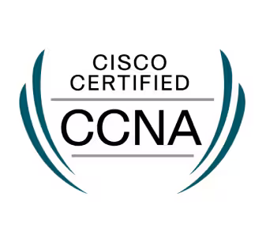

# Cisco Packet Tracer Tutorials

These are tutorials for learning how to use Cisco Packet Tracer to learn about computer networking. These tutorials will
help you prepare for the 200-301 CCNA exam.

