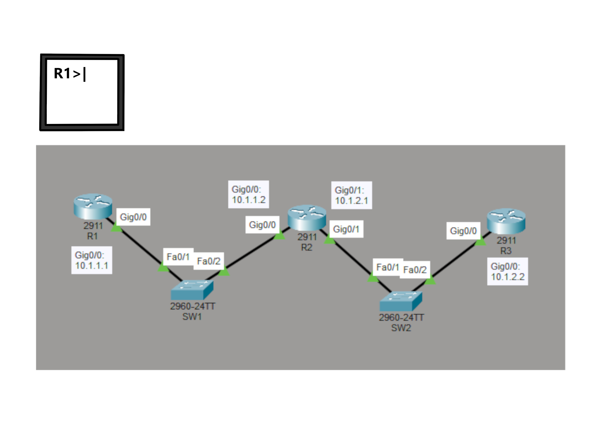

# Cisco Packet Tracer Tutorials

These are the tutorials for learning how to use Cisco Packet Tracer. You will learn about computer networking while you lab with Cisco Packet Tracer. These tutorials will help you prepare for the 200-301 CCNA exam.

  

    
  

  

    

    The CCNA is a vender specific certification by Cisco that validates your knowledge and skills in computer networking. To learn more about the CCNA, click the link at <a href="https://www.cisco.com/site/us/en/learn/training-certifications/certifications/enterprise/ccna/index.html">CCNA certification - Cisco Systems</a>.
    

  

