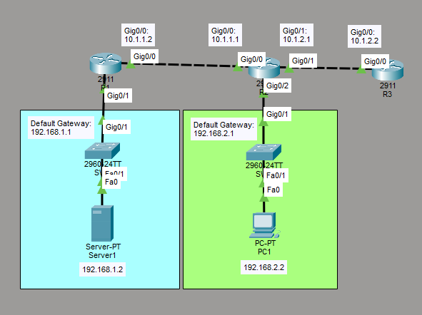

# Configure and Verify Access Control Lists

This is a guide to configure and verify access control lists (ACLs).



List of Devices:
- Routers
	- Model Name: 2911
	- Quantity: 3
- Server
	- Model Name: Server-PT
	- Quantity: 1
- PC:
	- Model Name: PC-PT
	- Quantity: 1
- Switches:
	- Mode Name: 2960
	- Quantity: 2

## IP Address Tables of the Routers
R1:
- Interface: GigabitEthernet 0/0
	- IPv4 Address: 10.1.1.2
	- Subnet Mask: 255.255.255.0
- Interface: GigabitEthernet 0/1
	- IPv4 Address: 192.168.1.1
	- Subnet Mask: 255.255.255.0

R2:
- Interface: GigabitEthernet 0/0
	- IPv4 Address: 10.1.1.1
	- Subnet Mask: 255.255.255.0
- Interface: GigabitEthernet 0/1
	- IPv4 Address: 10.1.2.1
	- Subnet Mask: 255.255.255.0
- Interface: GigabitEthernet 0/2
	- IPv4 Address: 192.168.2.1
	- Subnet Mask: 255.255.255.0

R3:
- Interface: GigabitEthernet 0/0
	- IPv4 Address: 10.1.2.2
	- Subnet Mask: 255.255.255.0

## IP Address Table for the PC
PC1:
- IPv4 Address: 192.168.2.2
- Subnet Mask: 255.255.255.0
- Default Gateway: 192.168.2.1

## IP Address Table for the Server
Server1:
- IPv4 Address: 192.168.1.2
- Subnet Mask: 255.255.255.0
- Default Gateway: 192.168.1.1

## Configure IP Address of the Routers
Configure the IP address of the interfaces of the routers.

Interface GigabitEthernet 0/0 on R1:
```
R1> en
R1# conf t
R1(config)# int Gig0/0
R1(config-if)# ip add 10.1.1.2 255.255.255.0
R1(config-if)# no shut
R1(config-if)# exit
```

Interface GigabitEthernet 0/1 on R1:
```
R1# conf t
R1(config)# int Gig0/1
R1(config-if)# ip add 192.168.1.1 255.255.255.0
R1(config-if)# no shut
R1(config-if)# end
```

Interface GigabitEthernet 0/0 on R2:
```
R2> en
R2# conf t
R2(config)# int Gig0/0
R2(config-if)# ip add 10.1.1.1 255.255.255.0
R2(config-if)# no shut
R2(config-if)# exit
```

Interface GigabitEthernet 0/1 on R2:
```
R2# conf t
R2(config)# int Gig0/1
R2(config-if)# ip add 10.1.2.1 255.255.255.0
R2(config-if)# no shut
R2(config-if)# exit
```

Interface GigabitEthernet 0/2 on R2:
```
R1# conf t
R1(config)# int Gig0/2
R1(config-if)# ip add 192.168.2.1 255.255.255.0
R1(config-if)# no shut
R1(config-if)# end
```

Interface GigabitEthernet 0/0 on R3:
```
R3> en
R3# conf t
R3(config)# int Gig0/0
R3(config-if)# ip add 10.1.2.2 255.255.255.0
R3(config-if)# no shut
R3(config-if)# end
```

## Configure Static Routing
Configure static routing on the routers.

Configure a static route for R1:
```
R1# conf t
R1(config)# ip route 10.1.2.0 255.255.255.0 10.1.1.1
R1(config)# ip route 192.168.2.0 255.255.255.0 10.1.1.1
R1(config)# end
```

Configure a static route for R2:
```
R2# conf t
R2(config)# ip route 192.168.1.0 255.255.255.0 10.1.1.2
R2(config)# end
```

Configure static routes for R3:
```
R3# conf t
R3(config)# ip route 10.1.1.0 255.255.255.0 10.1.2.1
R3(config)# ip route 192.168.1.0 255.255.255.0 10.1.2.1
R3(config)# ip route 192.168.2.0 255.255.255.0 10.1.2.1
R3(config)# end
```

## Configure IP Address for the PC
Configure the IP address for the PC.

On PC1, go to Desktop -> IP Configuration. Set the IPv4 Address, Subnet Mask, and Default Gateway according to the *IP Address Table for the PC*.

## Configure IP Address for the Server
Configure the IP address for the server.

On Server1, go to Desktop -> IP Configuration. Set the IPv4 Address, Subnet Mask, and Default Gateway according to the *IP Address Table for the Server*.

## Setup HTTP Server
Setup the HTTP server on the server.

On Server1, go to Services -> HTTP. Make sure that the HTTP service is on.

## Setup FTP Server
Setup the FTP server on the server.

On Server1, go to Services -> FTP. Make sure that the FTP service is on.

## Configure SSH
Configure SSH on the router.

Generate the RSA key with 768 bits for version 2 of SSH on R1:
```
R1# conf t
R1(config)# ip domain-name labs.networking.com
R1(config)# crypto key generate rsa
How many bits in the modulus [512]: 768
```

Configure SSH on R1:
```
R1(config)# ip ssh version 2
R1(config)# line vty 0 4
R1(config-line)# transport input ssh
R1(config-line)# end
```

## Configure Standard Numbered ACLs
Configure standard numbered ACLs on the router.

Configure a standard numbered ACL on R1:
```
R1# conf t
R1(config)# access-list 1 deny host 10.1.2.2
R1(config)# access-list 1 permit 10.1.1.0 0.0.0.255
R1(config)# end
```

Verify a standard numbered ACL by displaying the contents of the current access lists on R1:
```
R1# show access-lists
```

## Configure Standard Named ACL
Configure standard named ACLs on the router.

Configure a standard named ACL on R3:
```
R3# conf t
R3(config)# ip access-list standard MYACL
R3(config-std-nacl)# deny 10.1.1.0 0.0.0.255
R3(config-std-nacl)# permit 10.1.2.0 0.0.0.255
R3(config-std-nacl)# end
```

## Assign Standard ACLs
Assign standard ACLs to the interfaces of the router.

Assign standard numbered ACL to an interface of R1:
```
R1# conf t
R1(config)# interface Gig0/0
R1(config-if)# ip access-group 1 in
R1(config-if)# end
```

Verify ACL interface assignment on R1:
```
R1# show ip interface Gig0/0
```

Assign standard named ACL to an interface of R3:
```
R3# conf t
R3(config)# interface Gig0/0
R3(config-if)# ip access-group MYACL out
R3(config-if)# end
```

Verify ACL interface assignment on R3:
```
R3# show ip interface Gig0/0
```

Verify matches by displaying the contents of the current access lists on R1:
```
R1# show access-lists
```

Verify matches by displaying the contents of the current access lists on R3:
```
R3# show access-lists
```

## Configure Extended ACLs
Configure extended ACLs on the router.

Configure an extended ACL on R1:
```
R1# conf t
R1(config)# access-list 101 permit tcp 192.168.2.0 0.0.0.255 10.1.1.0 0.0.0.255 eq 22
R1(config)# access-list 101 permit tcp 192.168.2.0 0.0.0.255 192.168.1.0 0.0.0.255 eq 80
R1(config)# access-list 101 permit tcp 192.168.2.0 0.0.0.255 192.168.1.0 0.0.0.255 eq 21
R1(config)# interface Gig0/0
R1(config-if)# ip access-group 101 in
R1(config-if)# end
```

**Note**: For the commands on configuring an extended ACL, the first IP address represents the source IP address and the second IP address represents the destination IP address.

Verify matches by displaying the contents of the current access lists on R1:
```
R1# show access-lists
```

## Test Connections from the PC
Test the connections from the PC.

On PC1, go to Desktop -> Command Prompt. Test the SSH connection to R1 from PC1:
```
C:\> ssh -l R1 10.1.1.2
```

Test ftp connection to Server1 from PC1:
```
C:\> ftp 192.168.1.2
```

On PC1, go to Desktop -> Web Browser. Type 192.168.1.2 on the URL field. Click the go button.
Make sure that PC1's connection to the website hosted on Server1 works.

### Save Router Configurations
For each router, save the running config to the startup config.

Save config for R1:
```
R1# copy run start
```

Save config for R2:
```
R2# copy run start
```

Save config for R3:
```
R3# copy run start
```

## Resources
- [show access-lists command - Cisco](https://www.cisco.com/E-Learning/bulk/public/tac/cim/cib/using_cisco_ios_software/cmdrefs/show_access-lists.htm)