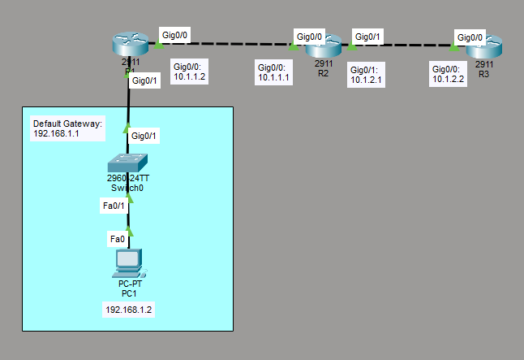

# Configure and Verify Device Access Controls
This is a guide to configure and verify device access controls.



List of Devices:
- Routers
	- Model Name: 2911
	- Quantity: 3
- PC:
	- Model Name: PC-PT
	- Quantity: 1
- Switch
	- Model Name: 2960
	- Quantity: 1

## IP Address Table for the Routers
R1:
- Interface: GigabitEthernet 0/0
	- IPv4 Address: 10.1.1.2
	- Subnet Mask: 255.255.255.0
- Interface: GigabitEthernet 0/1
	- IPv4 Address: 192.168.1.1
	- Subnet Mask: 255.255.255.0

R2:
- Interface: GigabitEthernet 0/0
	- IPv4 Address: 10.1.1.1
	- Subnet Mask: 255.255.255.0
- Interface: GigabitEthernet 0/1
	- IPv4 Address: 10.1.2.1
	- Subnet Mask: 255.255.255.0

R3:
- Interface: GigabitEthernet 0/0
	- IPv4 Address: 10.1.2.2
	- Subnet Mask: 255.255.255.0

## IP Address Table for the PC
PC1:
- IPv4 Address: 192.168.1.2
- Subnet Mask: 255.255.255.0
- Default Gateway: 192.168.1.1

## Configure IP Address of the Routers
Configure the IP address for the interfaces of the routers.

Interface GigabitEthernet 0/0 on R1:
```
R1> en
R1# conf t
R1(config)# int Gig0/0
R1(config-if)# ip add 10.1.1.2 255.255.255.0
R1(config-if)# no shut
R1(config-if)# exit
```

Interface GigabitEthernet 0/1 on R1:
```
R1(config)# int Gig0/1
R1(config-if)# ip add 192.168.1.1 255.255.255.0
R1(config-if)# no shut
R1(config-if)# end
```

Interface GigabitEthernet 0/0 on R2:
```
R2> en
R2# conf t
R2(config)# int Gig0/0
R2(config-if)# ip add 10.1.1.1 255.255.255.0
R2(config-if)# no shut
R2(config-if)# exit
```

Interface GigabitEthernet 0/1 on R2:
```
R2(config)# int Gig0/1
R2(config-if)# ip add 10.1.2.1 255.255.255.0
R2(config-if)# no shut
R2(config-if)# end
```

Interface GigabitEthernet 0/0 on R3:
```
R3> en
R3# conf t
R3(config)# int Gig0/0
R3(config-if)# ip add 10.1.2.2 255.255.255.0
R3(config-if)# no shut
R3(config-if)# end
```

## Configure Static Routing
Configure static routing on the routers.

Configure a static route for R1:
```
R1# conf t
R1(config)# ip route 10.1.2.0 255.255.255.0 10.1.1.1
R1(config)# end
```

Configure a static route for R2:
```
R2# conf t
R2(config)# ip route 192.168.1.0 255.255.255.0 10.1.1.2
R2(config)# end
```

Configure static routes for R3:
```
R3# conf t
R3(config)# ip route 10.1.1.0 255.255.255.0 10.1.2.1
R3(config)# ip route 192.168.1.0 255.255.255.0 10.1.2.1
R3(config)# end
```

## Configure and Verify Local Authentication
Configure and verify local authentication on the routers.

Configure local authentication for the console line on R1:
```
R1# conf t
R1(config)# aaa new-model
R1(config)# aaa authentication login default local
R1(config)# username john privilege 15 secret passwd123
R1(config)# line con 0
R1(config-line)# login authentication default
R1(config-line)# end
```

Verify the local authentication configuration on R1:
```
R1# exit

Press RETURN to get started.

User Access Verification
Username: john
Password: 
```

Configure local authentication for the console line on R2:
```
R2# conf t
R2(config)# aaa new-model
R2(config)# aaa authentication login default local
R2(config)# username john privilege 15 secret passwd123
R2(config)# line con 0
R2(config-line)# login authentication default
R2(config-line)# end
```

Verify the local authentication configuration on R2:
```
R2# exit

Press RETURN to get started.

User Access Verification
Username: john
Password: 
```

Configure local authentication for the console line on R3:
```
R3# conf t
R3(config)# aaa new-model
R3(config)# aaa authentication login default local
R3(config)# username john privilege 15 secret passwd123
R3(config)# line con 0
R3(config-line)# login authentication default
R3(config-line)# end
```

Verify the local authentication configuration on R3:
```
R3# exit

Press RETURN to get started.

User Access Verification
Username: john
Password: 
```

## Configure and Verify Service Password-Encryption Feature
Configure and verify service password-encryption feature on the routers.

Configure service password-encryption feature on R1:
```
R1# conf t
R1(config)# enable secret passwd123
R1(config)# line vty 0 4
R1(config-line)# password passwd1234
R1(config-line)# login authentication default
R1(config-line)# end
```

Display the hashed password on R1:
```
R1# show run
```

Configure service password-encryption feature on R2:
```
R2# conf t
R2(config)# enable secret passwd123
R2(config)# line vty 0 4
R2(config-line)# password passwd1234
R2(config-line)# login authentication default
R2(config-line)# end
```

Display the hashed password on R2:
```
R2# show run
```

Configure service password-encryption feature on R3:
```
R3# conf t
R3(config)# enable secret passwd123
R3(config)# line vty 0 4
R3(config-line)# password passwd1234
R3(config-line)# login authentication default
R3(config-line)# end
```

Display the hashed password on R3:
```
R3# show run
```

## Configure SSH
Configure SSH on the routers.

Generate the RSA key with 768 bits for version 2 of SSH on R1:
```
R1# conf t
R1(config)# ip domain-name labs.networking.com
R1(config)# crypto key generate rsa
How many bits in the modulus [512]: 768
```

Configure SSH on R1:
```
R1(config)# ip ssh version 2
R1(config)# line vty 0 4
R1(config-line)# transport input ssh
R1(config-line)# end
```

Generate the RSA key with 768 bits for version 2 of SSH on R2:
```
R2# conf t
R2(config)# ip domain-name labs.networking.com
R2(config)# crypto key generate rsa
How many bits in the modulus [512]: 768
```

Configure SSH on R2:
```
R2(config)# ip ssh version 2
R2(config)# line vty 0 4
R2(config-line)# transport input ssh
R2(config-line)# end
```

Generate the RSA key with 768 bits for version 2 of SSH on R3:
```
R3# conf t
R3(config)# ip domain-name labs.networking.com
R3(config)# crypto key generate rsa
How many bits in the modulus [512]: 768
```

Configure SSH on R3:
```
R3(config)# ip ssh version 2
R3(config)# line vty 0 4
R3(config-line)# transport input ssh
R3(config-line)# end
```

## Configure and Verify the Login Banner Message
Configure and verify the login banner message on the routers.

Configure the login banner message on R1:
```
R1# conf t
R1(config)# banner login #
Enter TEXT message. End with the character '#'.
This router is for the exclusive use of the employees of Micro Technologies.
Any other use is strictly prohibited.
Violators will be prosecuted to the full extent of the law.#
R1(config)# exit
```

Verify the login banner message on R1:
```
R1# exit

Press RETURN to get started.

This router is for the exclusive use of the employees of Micro Technologies.
Any other use is strictly prohibited.
Violators will be prosecuted to the full extent of the law.
User Access Verification

Username: john
Password:
R1>
```

Configure the login banner message on R2:
```
R2# conf t
R2(config)# banner login #
Enter TEXT message. End with the character '#'.
This router is for the exclusive use of the employees of Micro Technologies.
Any other use is strictly prohibited.
Violators will be prosecuted to the full extent of the law.#
R2(config)# exit
```

Verify the login banner message on R2:
```
R2# exit

Press RETURN to get started.

This router is for the exclusive use of the employees of Micro Technologies.
Any other use is strictly prohibited.
Violators will be prosecuted to the full extent of the law.
User Access Verification

Username: john
Password:
R2>
```

Configure the login banner message on R3:
```
R3# conf t
R3(config)# banner login #
Enter TEXT message. End with the character '#'.
This router is for the exclusive use of the employees of Micro Technologies.
Any other use is strictly prohibited.
Violators will be prosecuted to the full extent of the law.#
R3(config)# exit
```

Verify the login banner message on R3:
```
R3# exit

Press RETURN to get started.

This router is for the exclusive use of the employees of Micro Technologies.
Any other use is strictly prohibited.
Violators will be prosecuted to the full extent of the law.
User Access Verification

Username: john
Password:
R3>
```

## Configure IP Address for PC
Configure the IP address for the PC.

Go to Desktop -> IP Configuration. Set the IPv4 Address, Subnet Mask, and Default Gateway according to the *IP Address Table for the PC*.

## Test SSH Connections
Test the SSH connections from the PC to the routers.

Go to Desktop -> Command Prompt

Test the SSH connection with R1 from PC1:
```
C:\> ssh -l john 192.168.1.1

Password: 
R1>
```

Test the SSH connection with R2 from PC1:
```
C:\> ssh -l john 10.1.1.1

Password: 
R2>
```

Test the SSH connection with R3 from PC1:
```
C:\> ssh -l john 10.1.2.2

Password: 
R3>
```

### Save Router Configurations
For each router, save the running config to the startup config.

Save config for R1:
```
R1# copy run start
```

Save config for R2:
```
R2# copy run start
```

Save config for R3:
```
R3# copy run start
```

## Resources
- [7.2.6 Packet Tracer – Configure Local AAA for Console and VTY Access Answers - ITExamAnswers.net](https://itexamanswers.net/7-2-6-packet-tracer-configure-local-aaa-for-console-and-vty-access-answers.html)