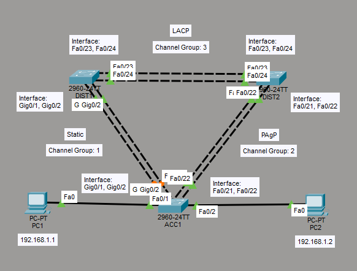
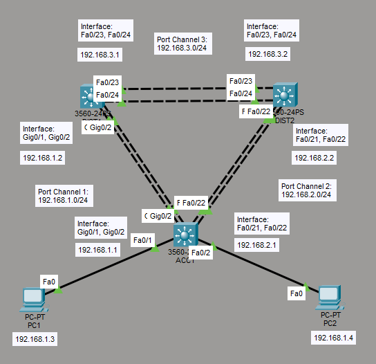

# Configure and Verify EtherChannel
This is a guide to configure and verify layer 2 and layer 3 EtherChannel on the switches.

## Part 1 - Configure and Verify Layer 2 EtherChannel
In this part, you will configure and verify layer 2 EtherChannel via PAgP, LACP, and static on the switches.



List of Devices:
- Switches:
	- Quantity: 3
	- Model Name: 2960
- PCs:
	- Quantity: 2
	- Model Name: PC-PT

### IP Address Table for the PCs
PC1:
- IPv4 Address: 192.168.1.1
- Subnet Mask: 255.255.255.0

PC2: 
- IPv4 Address: 192.168.1.2
- Subnet Mask: 255.255.255.0

### Configure and Verify Layer 2 EtherChannel with PAgP
Let's create a layer 2 EtherChannel using dynamic method Port Aggregation Protocol (PAgP). There are two settings possible here: auto and desirable.

Configure layer 2 EtherChannel via PAgP for the switches.

Interface Fa0/21 and Fa0/22 on ACC1:
```
ACC1# conf t
ACC1(config)# interface range Fa0/21, Fa0/22
ACC1(config-if-range)# channel-group 2 mode desirable
ACC1(config-if-range)# end
```

Interface Fa0/21 and Fa0/22 on DIST2:
```
DIST2# conf t
DIST2(config)# interface range Fa0/21, Fa0/22
DIST2(config-if-range)# channel-group 2 mode desirable
DIST2(config-if-range)# end
```

Verify layer 2 EtherChannel via PAgP on DIST2:
```
DIST2# show etherchannel summary
```

Verify layer 2 EtherChannel via PAgP on port channel 2 for DIST2:
```
DIST2# show interface port-channel 2
```

Verify layer 2 EtherChannel via PAgP on ACC1:
```
ACC1# show etherchannel summary
```

Verify layer 2 EtherChannel via PAgP on port channel 2 for ACC1:
```
ACC1# show interface port-channel 2
```

### Configure and Verify Layer 2 EtherChannel with LACP
This shows the creation of a Layer 2 EtherChannel using Link Aggregation Control Protocol (LACP) for automatic negotiation. This mode uses active or passive settings.

Configure a layer 2 EtherChannel via LACP for the multilayer switches.

Interface Fa0/23 and Fa0/24 on DIST1:
```
DIST1# conf t
DIST1(config)# interface range Fa0/23, Fa0/24
DIST1(config-if-range)# shutdown
DIST1(config-if-range)# channel-group 3 mode active
DIST1(config-if-range)# end
```

Interface Fa0/23 and Fa0/24 on DIST2:
```
DIST2# conf t
DIST2(config)# interface range Fa0/23, Fa0/24
DIST2(config-if-range)# channel-group 3 mode active
DIST2(config-if-range)# end
```

Turn on the interfaces for DIST1:
```
DIST1# conf t
DIST1(config)# interface range Fa0/23, Fa0/24
DIST1(config-if-range)# no shutdown
DIST1(config-if-range)# end
```

Verify layer 2 EtherChannel via LACP on DIST1:
```
DIST1# show etherchannel summary
```

Verify layer 2 EtherChannel via LACP on port channel 3 for DIST1:
```
DIST1# show interface port-channel 3
```

Verify layer 2 EtherChannel via LACP on DIST2:
```
DIST2# show etherchannel summary
```

Verify layer 2 EtherChannel via LACP on port channel 3 for DIST2:
```
DIST2# show interface port-channel 3
```

### Configure and Verify Static Layer 2 EtherChannel
Configure static layer 2 EtherChannel on the switches. 

Interface Gig0/1 and Gig0/2 on DIST1:
```
DIST1# conf t
DIST1(config)# interface range Gig0/1, Gig0/2
DIST1(config-if-range)# shutdown
DIST1(config-if-range)# channel-group 1 mode on
DIST1(config-if-range)# end
```

The shutdown command prevents EtherChannel misconfiguration errors as the other side of this link defaults to the use of PAgP or LACP for dynamically configuring an EtherChannel. LACP and PAgP are not used when statically configuring an EtherChannel.

Interface Gig0/1 and Gig0/2 on ACC1:
```
ACC1# conf t
ACC1(config)# interface range Gig0/1, Gig0/2
ACC1(config-if-range)# channel-group 1 mode on
ACC1(config-if-range)# end
```

Turn on the interfaces for DIST1:
```
DIST1# conf t
DIST1(config)# interface range Gig0/1, Gig0/2
DIST1(config-if-range)# no shutdown
DIST1(config-if-range)# end
```

Verify static layer 2 EtherChannel on DIST1:
```
DIST1# show etherchannel summary
```

Verify static layer 2 EtherChannel on port channel 1 for DIST1:
```
DIST1# show interface port-channel 1
```

Verify static layer 2 EtherChannel on ACC1:
```
ACC1# show etherchannel summary
```

Verify static layer 2 EtherChannel on port channel 1 for ACC1:
```
ACC1# show interface port-channel 1
```

### Configure IP Address for the PCs
Configure the IP address for the PCs.

Go to Desktop -> IP Configuration. Set the IPv4 Address, Subnet Mask, and Default Gateway according to the *IP Address Table for the PCs*.

### Save Switch Configurations
Go to each switch and save the running configuration to the startup configuration.

Save the config for ACC1:
```
ACC1# copy run start
```

Save the config for DIST1:
```
DIST1# copy run start
```

Save the config for DIST2:
```
DIST2# copy run start
```

## Part 2 - Configure and Verify Layer 3 EtherChannel
In this part, you will configure and verify layer 3 EtherChannel on the multilayer switches.



List of Devices:
- Multilayer Switches:
	- Quantity: 3
	- Model Name: 3560
- PCs:
	- Quantity: 2
	- Model Name: PC-PT

### IP Address Table for the PCs
PC1:
- IPv4 Address: 192.168.1.3
- Subnet Mask: 255.255.255.0

PC2: 
- IPv4 Address: 192.168.1.4
- Subnet Mask: 255.255.255.0

### Configure and Verify Layer 3 EtherChannel
Let's create a layer 3 EtherChannel with multilayer switches.

**Port Channel 1**

Configure a layer 3 EtherChannel on port channel 1 for the multilayer switches.

Interface Gig0/1 and Gig0/2 on ACC1:
```
ACC1# conf t
ACC1(config)# interface port-channel 1
ACC1(config-if)# no switchport
ACC1(config-if)# ip address 192.168.1.1 255.255.255.0
ACC1(config-if)# exit
ACC1(config)# interface range Gig0/1, Gig0/2
ACC1(config-if-range)# no switchport
ACC1(config-if-range)# shutdown
```

Turn on the interfaces for ACC1:
```
ACC1(config-if-range)# channel-group 1 mode on
ACC1(config-if-range)# no shutdown
ACC1(config-if-range)# end
```

Interface Gig0/1 and Gig0/2 on DIST1:
```
DIST1# conf t
DIST1(config)# interface port-channel 1
DIST1(config-if)# no switchport
DIST1(config-if)# ip address 192.168.1.2 255.255.255.0
DIST1(config-if)# exit
DIST1(config)# interface range Gig0/1, Gig0/2
DIST1(config-if-range)# no switchport
DIST1(config-if-range)# shutdown
```

Turn on the interfaces for DIST1:
```
DIST1(config-if-range)# channel-group 1 mode on
DIST1(config-if-range)# no shutdown
DIST1(config-if-range)# end
```

Verify layer 3 EtherChannel on DIST1:
```
DIST1# show etherchannel summary
```

Verify layer 3 EtherChannel on port channel 1 for DIST1:
```
DIST1# show interface port-channel 1
```

Verify layer 3 EtherChannel on ACC1:
```
ACC1# show etherchannel summary
```

Verify layer 3 EtherChannel on port channel 1 for ACC1:
```
ACC1# show interface port-channel 1
```

**Port Channel 2**

Configure a layer 3 EtherChannel on port channel 2 for the multilayer switches.

Interface Fa0/21 and Fa0/22 on ACC1:
```
ACC1# conf t
ACC1(config)# interface port-channel 2
ACC1(config-if)# no switchport
ACC1(config-if)# ip address 192.168.2.1 255.255.255.0
ACC1(config-if)# exit
ACC1(config)# interface range Fa0/21, Fa0/22
ACC1(config-if-range)# no switchport
ACC1(config-if-range)# shutdown
```

Turn on the interfaces for ACC1:
```
ACC1(config-if-range)# channel-group 2 mode on
ACC1(config-if-range)# no shutdown
ACC1(config-if-range)# end
```

Interface Fa0/21 and Fa0/22 on DIST2:
```
DIST2# conf t
DIST2(config)# interface port-channel 2
DIST2(config-if)# no switchport
DIST2(config-if)# ip address 192.168.2.2 255.255.255.0
DIST2(config-if)# exit
DIST2(config)# interface range Fa0/21, Fa0/22
DIST2(config-if-range)# no switchport
DIST2(config-if-range)# shutdown
```

Turn on the interfaces for DIST2:
```
DIST2(config-if-range)# channel-group 2 mode on
DIST2(config-if-range)# no shutdown
DIST2(config-if-range)# end
```

Verify layer 3 EtherChannel on DIST2:
```
DIST2# show etherchannel summary
```

Verify layer 3 EtherChannel on port channel 2 for DIST2:
```
DIST2# show interface port-channel 2
```

Verify layer 3 EtherChannel on ACC1:
```
ACC1# show etherchannel summary
```

Verify layer 3 EtherChannel on port channel 2 for ACC1:
```
ACC1# show interface port-channel 2
```

**Port Channel 3**

Configure a layer 3 EtherChannel on port channel 3 for the multilayer switches.

Interface Fa0/23 and Fa0/24 on DIST1:
```
DIST1# conf t
DIST1(config)# interface port-channel 3
DIST1(config-if)# no switchport
DIST1(config-if)# ip address 192.168.3.1 255.255.255.0
DIST1(config-if)# exit
DIST1(config)# interface range Fa0/23, Fa0/24
DIST1(config-if-range)# no switchport
DIST1(config-if-range)# shutdown
```

Turn on the interfaces for DIST1:
```
DIST1(config-if-range)# channel-group 3 mode on
DIST1(config-if-range)# no shutdown
DIST1(config-if-range)# end
```

Interface Fa0/23 and Fa0/24 on DIST2:
```
DIST2# conf t
DIST2(config)# interface port-channel 3
DIST2(config-if)# no switchport
DIST2(config-if)# ip address 192.168.3.2 255.255.255.0
DIST2(config-if)# exit
DIST2(config)# interface range Fa0/23, Fa0/24
DIST2(config-if-range)# no switchport
DIST2(config-if-range)# shutdown
```

Turn on the interfaces for DIST2:
```
DIST2(config-if-range)# channel-group 3 mode on
DIST2(config-if-range)# no shutdown
DIST2(config-if-range)# end
```

Verify layer 3 EtherChannel on DIST2:
```
DIST2# show etherchannel summary
```

Verify layer 3 EtherChannel on port channel 3 for DIST2:
```
DIST2# show interface port-channel 3
```

Verify layer 3 EtherChannel on DIST1:
```
DIST1# show etherchannel summary
```

Verify layer 3 EtherChannel on port channel 3 for DIST1:
```
DIST1# show interface port-channel 3
```

### Configure IP Address for the PCs
Configure the IP address for the PCs.

Go to Desktop -> IP Configuration. Set the IPv4 Address, Subnet Mask, and Default Gateway according to the *IP Address Table for the PCs*.

### Save Switch Configurations
Go to each multilayer switch and save the running configuration to the startup configuration.

Save the config for ACC1:
```
ACC1# copy run start
```

Save the config for DIST1:
```
DIST1# copy run start
```

Save the config for DIST2:
```
DIST2# copy run start
```
## Resources
- [EtherChannel Modes: PAGP Mode, LACP Modes & On Mode - IP With Ease](https://ipwithease.com/etherchannel-modes-pagp-lacp-and-on/)
- [6.2.4 Packet Tracer – Configure EtherChannel (Instructor Version) - ITExamAnswers.net](https://itexamanswers.net/6-2-4-packet-tracer-configure-etherchannel-instructions-answer.html)
- [Cisco Layer 3 EtherChannel Explained & Configured - study-ccna.com](https://study-ccna.com/cisco-layer-3-etherchannel/)
- [Port Channel vs Etherchannel: What is the difference?](https://ipwithease.com/port-channel-vs-etherchannel/#what-is-port-channel)
- [Troubleshoot EtherChannel: show etherchannel summary - study-ccnp.com](https://study-ccnp.com/troubleshoot-etherchannel-show-etherchannel-summary/)
- [Port-Channel/Channel Group vs Ether Channel/Link Aggregation - edledge](https://edledge.com/ea00097/)