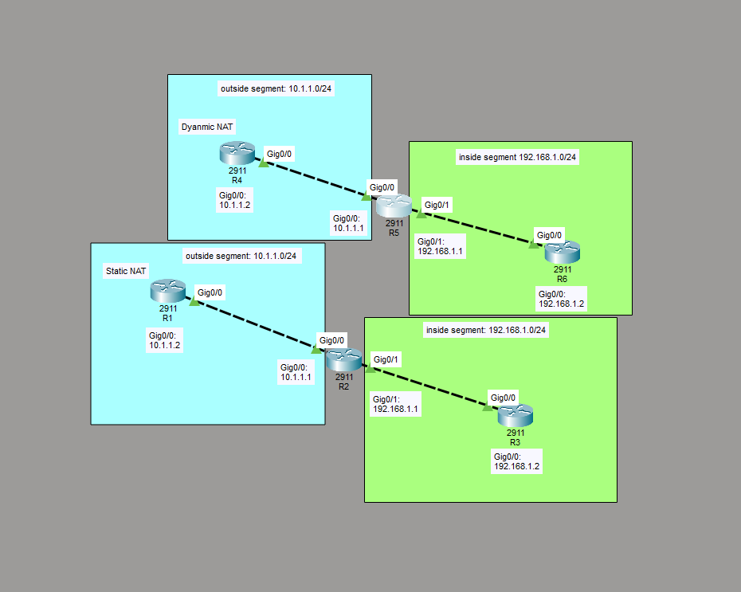

# Configure and Verify Inside Source NAT

This is a guide to configure and verify inside source NAT.



These are the network addresses for the inside and outside segments in static and dynamic NAT:
- Inside Segment: 192.168.1.0/24
- Outside Segment: 10.1.1.0/24

## IP Address Table for the Routers

**Routers for Static NAT**

R1:
- Interface: GigabitEthernet0/0
	- IP Address: 10.1.1.2
	- Subnet Mask: 255.255.255.0

R2:
- Interface: GigabitEthernet0/0
	- IP Address: 10.1.1.1
	- Subnet Mask: 255.255.255.0
- Interface: GigabitEthernet0/1
	- IP Address: 192.168.1.1
	- Subnet Mask: 255.255.255.0

R3:
- Interface: GigabitEthernet0/0
	- IP Address: 192.168.1.2
	- Subnet Mask: 255.255.255.0

**Routers for Dynamic NAT**

R4:
- Interface: GigabitEthernet0/0
	- IP Address: 10.1.1.2
	- Subnet Mask: 255.255.255.0

R5:
- Interface: GigabitEthernet0/0
	- IP Address: 10.1.1.1
	- Subnet Mask: 255.255.255.0
- Interface: GigabitEthernet0/1
	- IP Address: 192.168.1.1
	- Subnet Mask: 255.255.255.0

R6:
- Interface: GigabitEthernet0/0
	- IP Address: 192.168.1.2
	- Subnet Mask: 255.255.255.0

## Configure IP Addresses for the Routers
Configure the IP addresses for the interfaces of the routers.

**Routers for Static NAT**

Interface GigabitEthernet0/0 on R1:
```
R1# conf t
R1(config)# interface Gig0/0
R1(config-if)# ip add 10.1.1.2 255.255.255.0
R1(config-if)# no shut
R1(config-if)# end
```

Interface GigabitEthernet0/0 on R2:
```
R2# conf t
R2(config)# interface Gig0/0
R2(config-if)# ip add 10.1.1.1 255.255.255.0
R2(config-if)# no shut
R2(config-if)# end
```

Interface GigabitEthernet0/1 on R2:
```
R2# conf t
R2(config)# interface Gig0/1
R2(config-if)# ip add 192.168.1.1 255.255.255.0
R2(config-if)# no shut
R2(config-if)# end
```

Interface GigabitEthernet0/0 on R3:
```
R3# conf t
R3(config)# interface Gig0/0
R3(config-if)# ip add 192.168.1.2 255.255.255.0
R3(config-if)# no shut
R3(config-if)# end
```

**Routers for Dynamic NAT**

Interface GigabitEthernet0/0 on R4:
```
R4# conf t
R4(config)# interface Gig0/0
R4(config-if)# ip add 10.1.1.2 255.255.255.0
R4(config-if)# no shut
R4(config-if)# end
```

Interface GigabitEthernet0/0 on R5:
```
R5# conf t
R5(config)# interface Gig0/0
R5(config-if)# ip add 10.1.1.1 255.255.255.0
R5(config-if)# no shut
R5(config-if)# end
```

Interface GigabitEthernet0/1 on R5:
```
R5# conf t
R5(config)# interface Gig0/1
R5(config-if)# ip add 192.168.1.1 255.255.255.0
R5(config-if)# no shut
R5(config-if)# end
```

Interface GigabitEthernet0/0 on R6:
```
R6# conf t
R6(config)# interface Gig0/0
R6(config-if)# ip add 192.168.1.2 255.255.255.0
R6(config-if)# no shut
R6(config-if)# end
```
## Static Nat Configuration

Configure inside source static NAT on R2:
```
R2# conf t
R2(config)# interface Gig0/1
R2(config-if)# ip nat inside
R2(config-if)# exit
R2(config)# interface Gig0/0
R2(config-if)# ip nat outside
R2(config-if)# exit
R2(config)# ip nat inside source static 10.1.1.1 192.168.1.100
R2(config)# end
```

**Verify inside source static NAT**

Ping the IP address of interface Gig0/0 of R2:
```
R1# ping 10.1.1.1
```

View the active NAT mappings of R2:
```
R2# show ip nat translation
```
## Dynamic Nat Configuration

Configure inside source dynamic NAT on R5:
```
R5# conf t
R5(config)# interface Gig0/1
R5(config-if)# ip nat inside
R5(config-if)# exit
R5(config)# interface Gig0/0
R5(config-if)# ip nat outside
R5(config-if)# exit
R5(config)# access-list 1 permit 10.1.1.1
R5(config)# access-list 1 permit 10.1.1.100
R5(config)# ip nat pool MYNATPOOL 192.168.1.100 192.168.1.101 netmask 255.255.255.0
R5(config)# ip nat inside source list 1 pool MYNATPOOL
R5(config)# end
```

**Verify inside source dynamic NAT**

Ping the IP address of interface Gig0/0 of R5:
```
R4# ping 10.1.1.1
```

View the active NAT mappings of R5:
```
R5# show ip nat translation
```

## Save Router Configurations

Save the running config to the startup config for the routers.

**Routers for Static NAT**

Saving config for R1:
```
R1#copy running-config startup-config
```

Saving config for R2:
```
R2#copy running-config startup-config
```

Saving config for R3:
```
R3#copy running-config startup-config
```

**Routers for Dynamic NAT**

Saving config for R4:
```
R4#copy running-config startup-config
```

Saving config for R5:
```
R5#copy running-config startup-config
```

Saving config for R6:
```
R6#copy running-config startup-config
```