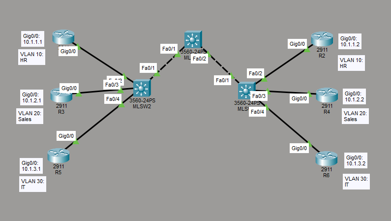

# Configure and Verify Interswitch Connectivity

This is a guide to configure and verify interswitch connectivity on the multilayer switches.



List of Devices:
1. Routers:
	1. Quantity: 6
	2. Model Name: 2911
2. Multilayer Switches:
	1. Quantity: 3
	2. Model Name: 3560

Configure IP address for the interfaces of the routers.

Interface Gig0/0 on R1:
```
R1> en
R1# conf t
R1(config)# int Gig0/0
R1(config-if)# ip add 10.1.1.1 255.255.255.0
R1(config-if)# no shut
R1(config-if)# end
```

Interface Gig0/0 on R2:
```
R2> en
R2# conf t
R2(config)# int Gig0/0
R2(config-if)# ip add 10.1.1.2 255.255.255.0
R2(config-if)# no shut
R2(config-if)# end
```

Interface Gig0/0 on R3:
```
R3> en
R3# conf t
R3(config)# int Gig0/0
R3(config-if)# ip add 10.1.2.1 255.255.255.0
R3(config-if)# no shut
R3(config-if)# end
```

Interface Gig0/0 on R4:
```
R4> en
R4# conf t
R4(config)# int Gig0/0
R4(config-if)# ip add 10.1.2.2 255.255.255.0
R4(config-if)# no shut
R4(config-if)# end
```

Interface Gig0/0 on R5:
```
R5> en
R5# conf t
R5(config)# int Gig0/0
R5(config-if)# ip add 10.1.3.1 255.255.255.0
R5(config-if)# no shut
R5(config-if)# end
```

Interface Gig0/0 on R6:
```
R6> en
R6# conf t
R6(config)# int Gig0/0
R6(config-if)# ip add 10.1.3.2 255.255.255.0
R6(config-if)# no shut
R6(config-if)# end
```

## Configure and Verify VLANs for the Multilayer Switches
Configure and verify VLANs for the multilayer switches.

Create VLANs for HR, Sales, and IT on MLSW1:
```
MLSW1(config)# vlan 10
MLSW1(config-vlan)# name HR
MLSW1(config-vlan)# exit
MLSW1(config)# vlan 20
MLSW1(config-vlan)# name Sales
MLSW1(config-vlan)# exit
MLSW1(config)# vlan 30
MLSW1(config-vlan)# name IT
MLSW1(config-vlan)# exit
```

Create VLANs for HR, Sales, and IT on MLSW2:
```
MLSW2(config)# vlan 10
MLSW2(config-vlan)# name HR
MLSW2(config-vlan)# exit
MLSW2(config)# vlan 20
MLSW2(config-vlan)# name Sales
MLSW2(config-vlan)# exit
MLSW2(config)# vlan 30
MLSW2(config-vlan)# name IT
MLSW2(config-vlan)# exit
```

Create VLANs for HR, Sales, and IT on MLSW3:
```
MLSW3(config)# vlan 10
MLSW3(config-vlan)# name HR
MLSW3(config-vlan)# exit
MLSW3(config)# vlan 20
MLSW3(config-vlan)# name Sales
MLSW3(config-vlan)# exit
MLSW3(config)# vlan 30
MLSW3(config-vlan)# name IT
MLSW3(config-vlan)# exit
```

Assign VLANs for MLSW2 and MLSW3.

Assign VLANs to the interfaces on MLSW2:
```
MLSW2(config)# int Fa0/2
MLSW2(config-if)# switchport mode access
MLSW2(config-if)# switchport access vlan 10
MLSW2(config-if)# exit
MLSW2(config-if)# int Fa0/3
MLSW2(config-if)# switchport mode access
MLSW2(config-if)# switchport access vlan 20
MLSW2(config-if)# exit
MLSW2(config-if)# int Fa0/4
MLSW2(config-if)# switchport mode access
MLSW2(config-if)# switchport access vlan 30
MLSW2(config-if)# end
```

Assign VLANs to the interfaces on MLSW3:
```
MLSW3(config)# int Fa0/2
MLSW3(config-if)# switchport mode access
MLSW3(config-if)# switchport access vlan 10
MLSW3(config-if)# exit
MLSW3(config-if)# int Fa0/3
MLSW3(config-if)# switchport mode access
MLSW3(config-if)# switchport access vlan 20
MLSW3(config-if)# exit
MLSW3(config-if)# int Fa0/4
MLSW3(config-if)# switchport mode access
MLSW3(config-if)# switchport access vlan 30
MLSW3(config-if)# end
```

## Configure and Verify Trunking for the Multilayer Switches
Configure and verify trunking for the multilayer switches.

On Interface Fa0/1 on MLSW1:
```
MLSW1# conf t
MLSW1(config)# int Fa0/1
MLSW1(config-if)# switchport trunk encapsulation dot1q
MLSW1(config-if)# switchport mode trunk
MLSW1(config-if)# exit
```

On Interface Fa0/2 on MLSW1:
```
MLSW1(config)# int Fa0/2
MLSW1(config-if)# switchport trunk encapsulation dot1q
MLSW1(config-if)# switchport mode trunk
MLSW1(config-if)# end
```

Verify trunking on MLSW1:
```
MLSW1# show int Fa0/1 switchport
MLSW1# show int Fa0/2 switchport
MLSW1# show int trunk
```

Configure trunking on MLSW2 and MLSW3. 

On Interface Fa0/1 on MLSW2:
```
MLSW2(config)# int Fa0/1
MLSW2(config-if)# switchport trunk encapsulation dot1q
MLSW2(config-if)# switchport mode trunk
MLSW2(config-if)# end
```

On Interface Fa0/1 on MLSW3:
```
MLSW3(config)# int Fa0/1
MLSW2(config-if)# switchport trunk encapsulation dot1q
MLSW3(config-if)# switchport mode trunk
MLSW3(config-if)# end
```

Verify trunking on MLSW2:
```
MLSW2# show int Fa0/1 switchport
MLSW2# show int trunk
```

Verify trunking on MLSW3:
```
MLSW3# show int Fa0/1 switchport
MLSW3# show int trunk
```

## Save Router Configurations
Go to each router and save the running configuration to the startup configuration.

Save the config for R1:
```
R1# copy run start
```

Save the config for R2:
```
R2# copy run start
```

Save the config for R3:
```
R3# copy run start
```

Save the config for R4:
```
R4# copy run start
```

Save the config for R5:
```
R5# copy run start
```

Save the config for R6:
```
R6# copy run start
```

## Save Multilayer Switch Configurations
Go to each multilayer switch and save the running configuration to the startup configuration.

Save the config for MLSW1:
```
MLSW1# copy run start
```

Save the config for MLSW2:
```
MLSW2# copy run start
```

Save the config for MLSW3:
```
MLSW3# copy run start
```

## Resources
- [3.4.5 Packet Tracer – Configure Trunks (Instructions Answer) - ITExamAnswers.net](https://itexamanswers.net/3-4-5-packet-tracer-configure-trunks-instructions-answer.html)
- [3.3.12 Packet Tracer – VLAN Configuration (Instructions Answer) - ITExamAnswers.net](https://itexamanswers.net/3-3-12-packet-tracer-vlan-configuration-instructions-answer.html)