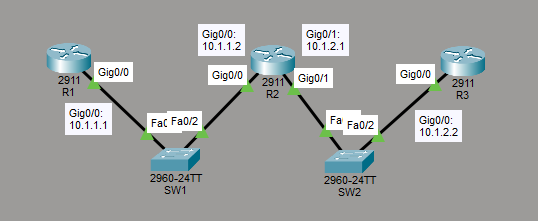

# Configure and Verify Layer 2 Discovery Protocols
This is a guide to configure and verify layer 2 discovery protocols. You will configure and verify Cisco Discovery Protocol (CDP) and Link Layer Discovery Protocol (LLDP) on the switches and routers.



List of Devices:
1. Routers:
	1. Quantity: 3
	2. Model Name: 2911
2. Switches:
	1. Quantity: 2
	2. Model Name: 2960

## IP Address Table for the Routers
R1:
- Interface: GigabitEthernet 0/0
	- IPv4 Address: 10.1.1.1
	- Subnet Mask: 255.255.255.0

R2:
- Interface: GigabitEthernet 0/0
	- IPv4 Address: 10.1.1.2
	- Subnet Mask: 255.255.255.0
- Interface: GigabitEthernet 0/1
	- IPv4 Address: 10.1.2.1
	- Subnet Mask: 255.255.255.0

R3:
- Interface: GigabitEthernet 0/0
	- IPv4 Address: 10.1.2.2
	- Subnet Mask: 255.255.255.0

## Configure IP Addresses for the Routers
Configure the IP addresses for the interfaces of the routers.

Interface Gig0/0 on R1:
```
R1# conf t
R1(config)# int Gig0/0
R1(config-if)# ip add 10.1.1.1 255.255.255.0
R1(config-if)# no shut
R1(config-if)# end
```

Interface Gig0/0 on R2:
```
R2# conf t
R2(config)# int Gig0/0
R2(config-if)# ip add 10.1.1.2 255.255.255.0
R2(config-if)# no shut
R2(config-if)# end
```

Interface Gig0/1 on R2:
```
R2# conf t
R2(config)# int Gig0/1
R2(config-if)# ip add 10.1.2.1 255.255.255.0
R2(config-if)# no shut
R2(config-if)# end
```

Interface Gig0/0 on R3:
```
R3# conf t
R3(config)# int Gig0/0
R3(config-if)# ip add 10.1.2.2 255.255.255.0
R3(config-if)# no shut
R3(config-if)# end
```

## Configure and Verify CDP
Configure and verify Cisco Discovery Protocol (CDP) on the switches.

**SW1**

Ensure CDP is running on SW1:
```
SW1> en
SW1# conf t
SW1(config)# cdp run
```

Ensure CDP is running on the interfaces.

Interface Fa0/1 on SW1:
```
SW1(config)# int Fa0/1
SW1(config-if)# cdp enable
SW1(config-if)# exit
```

Interface Fa0/2 on SW1:
```
SW1(config)# int Fa0/2
SW1(config-if)# cdp enable
SW1(config-if)# end
```

Verify that CDP is running globally on SW1:
```
SW1# show cdp
```

Verify that CDP is enabled on the interfaces.

Interface Fa0/1 on SW1:
```
SW1# show cdp int Fa0/1
```

Interface Fa0/2 on SW1:
```
SW1# show cdp int Fa0/2
```

View the information collected by CDP about neighboring devices:
```
SW1# show cdp neighbors detail
```

**SW2**

Ensure CDP is running on SW2:
```
SW2> en
SW2# conf t
SW2(config)# cdp run
```

Ensure CDP is running on the interfaces.

Interface Fa0/1 on SW2:
```
SW2(config)# int Fa0/1
SW2(config-if)# cdp enable
SW2(config-if)# exit
```

Interface Fa0/2 on SW2:
```
SW2(config)# int Fa0/2
SW2(config-if)# cdp enable
SW2(config-if)# end
```

Verify that CDP is running globally on SW1:
```
SW2# show cdp
```

Verify that CDP is enabled on the interfaces.

Interface Fa0/1 on SW2:
```
SW2# show cdp int Fa0/1
```

Interface Fa0/2 on SW2:
```
SW2# show cdp int Fa0/2
```

View the information collected by CDP about neighboring devices:
```
SW2# show cdp neighbors detail
```

## Configure and Verify LLDP
Configure and verify Link Layer Discovery Protocol (LLDP) on the switches and routers.

**R1**

Ensure LLDP is running globally on R1:
```
R1# conf t
R1(config)# lldp run
```

Ensure LLDP is running on the interfaces.

Interface Gig0/0 on R1:
```
R1(config)# int Gig0/0
R1(config-if)# lldp transmit
R1(config-if)# lldp receive
R1(config-if)# end
```

Verify that LLDP is running globally on R1:
```
R1# show lldp
```

View the information collected by LLDP about neighboring devices:
```
R1# show lldp neighbors detail
```

**R2**

Ensure LLDP is running globally on R2:
```
R2# conf t
R2(config)# lldp run
```

Ensure LLDP is running on the interfaces.

Interface Gig0/0 on R2:
```
R2(config)# int Gig0/0
R2(config-if)# lldp transmit
R2(config-if)# lldp receive
R2(config-if)# exit
```

Interface Gig0/1 on R2:
```
R2(config)# int Gig0/1
R2(config-if)# lldp transmit
R2(config-if)# lldp receive
R2(config-if)# end
```

Verify that LLDP is running globally on R2:
```
R2# show lldp
```

View the information collected by LLDP about neighboring devices:
```
R2# show lldp neighbors detail
```

**R3**

Ensure LLDP is running globally on R3:
```
R3# conf t
R3(config)# lldp run
```

Ensure LLDP is running on the interfaces.

Interface Gig0/0 on R3:
```
R3(config)# int Gig0/0
R3(config-if)# lldp transmit
R3(config-if)# lldp receive
R3(config-if)# end
```

Verify that LLDP is running globally on R3:
```
R3# show lldp
```

View the information collected by LLDP about neighboring devices:
```
R3# show lldp neighbors detail
```

**SW1**

Ensure LLDP is running globally on SW1:
```
SW1# conf t
SW1(config)# lldp run
```

Ensure LLDP is running on the interfaces.

Interface Fa0/1 on SW1:
```
SW1(config)# int Fa0/1
SW1(config-if)# lldp transmit
SW1(config-if)# lldp receive
SW1(config-if)# exit
```

Interface Fa0/2 on SW1:
```
SW1(config)# int Fa0/2
SW1(config-if)# lldp transmit
SW1(config-if)# lldp receive
SW1(config-if)# end
```

Verify that LLDP is running globally on SW1:
```
SW1# show lldp
```

View the information collected by LLDP about neighboring devices:
```
SW1# show lldp neighbors detail
```

**SW2**

Ensure LLDP is running globally on SW2:
```
SW2# conf t
SW2(config)# lldp run
```

Ensure LLDP is running on the interfaces.

Interface Fa0/1 on SW2:
```
SW2(config)# int Fa0/1
SW2(config-if)# lldp transmit
SW2(config-if)# lldp receive
SW2(config-if)# exit
```

Interface Fa0/2 on SW2:
```
SW2(config)# int Fa0/2
SW2(config-if)# lldp transmit
SW2(config-if)# lldp receive
SW2(config-if)# end
```

Verify that LLDP is running globally on SW2:
```
SW2# show lldp
```

View the information collected by LLDP about neighboring devices:
```
SW2# show lldp neighbors detail
```

## Save Router Configurations
Go to each router and save the running configuration to the startup configuration.

Save the config for R1:
```
R1# copy run start
```

Save the config for R2:
```
R2# copy run start
```

Save the config for R3:
```
R3# copy run start
```

## Save Switch Configurations
Go to each switch and save the running configuration to the startup configuration.

Save the config for SW1:
```
SW1# copy run start
```

Save the config for SW2:
```
SW2# copy run start
```