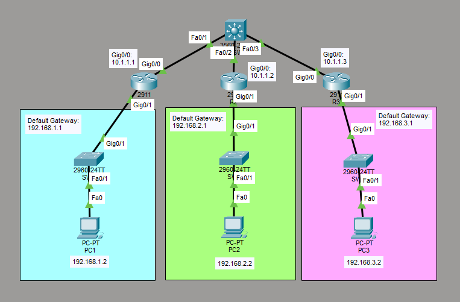

# Configure and Verify Layer 2 Security Features
This is a guide to configure and verify layer 2 security features. The Layer 2 security mechanisms that are being used in this guide are port security, DHCP snooping, and dynamic ARP inspection.



List of Devices:
- Multilayer Switch:
	- Model Name: 3560
	- Quantity: 1
- Routers:
	- Model Name: 2911
	- Quantity: 3
- Switches:
	- Model Name: 2960
	- Quantity: 3
- PCs:
	- Model Name: PC-PT
	- Quantity: 3

## IP Address Tables of the Routers
R1:
- Interface: GigabitEthernet 0/0
	- IPv4 Address: 10.1.1.1
	- Subnet Mask: 255.255.255.0
- Interface: GigabitEthernet 0/1
	- IPv4 Address: 192.168.1.1
	- Subnet Mask: 255.255.255.0

R2:
- Interface: GigabitEthernet 0/0
	- IPv4 Address: 10.1.1.2
	- Subnet Mask: 255.255.255.0
- Interface: GigabitEthernet 0/1
	- IPv4 Address: 192.168.2.1
	- Subnet Mask: 255.255.255.0

R3:
- Interface: GigabitEthernet 0/0
	- IPv4 Address: 10.1.1.3
	- Subnet Mask: 255.255.255.0
- Interface: GigabitEthernet 0/1
	- IPv4 Address: 192.168.3.1
	- Subnet Mask: 255.255.255.0

## IP Address Table for the PCs
PC1:
- IPv4 Address: 192.168.1.2
- Subnet Mask: 255.255.255.0
- Default Gateway: 192.168.1.1

PC2:
- IPv4 Address: 192.168.2.2
- Subnet Mask: 255.255.255.0
- Default Gateway: 192.168.2.1

PC3:
- IPv4 Address: 192.168.3.2
- Subnet Mask: 255.255.255.0
- Default Gateway: 192.168.3.1

## Configure IP Address of the Routers
Configure the IP address of the interfaces of the routers.

Interface GigabitEthernet 0/0 on R1:
```
R1> en
R1# conf t
R1(config)# int Gig0/0
R1(config-if)# ip add 10.1.1.1 255.255.255.0
R1(config-if)# no shut
R1(config-if)# exit
```

Interface GigabitEthernet 0/1 on R1:
```
R1(config)# int Gig0/1
R1(config-if)# ip add 192.168.1.1 255.255.255.0
R1(config-if)# no shut
R1(config-if)# end
```

Interface GigabitEthernet 0/0 on R2:
```
R2> en
R2# conf t
R2(config)# int Gig0/0
R2(config-if)# ip add 10.1.1.2 255.255.255.0
R2(config-if)# no shut
R2(config-if)# exit
```

Interface GigabitEthernet 0/1 on R2:
```
R2(config)# int Gig0/1
R2(config-if)# ip add 192.168.2.1 255.255.255.0
R2(config-if)# no shut
R2(config-if)# end
```

Interface GigabitEthernet 0/0 on R3:
```
R3> en
R3# conf t
R3(config)# int Gig0/0
R3(config-if)# ip add 10.1.1.3 255.255.255.0
R3(config-if)# no shut
R3(config-if)# exit
```

Interface GigabitEthernet 0/1 on R3:
```
R3(config)# int Gig0/1
R3(config-if)# ip add 192.168.3.1 255.255.255.0
R3(config-if)# no shut
R3(config-if)# end
```

## Configure IP Address for the PC
Configure the IP address for the PCs.

For each PC, go to Desktop -> IP Configuration. Set the IPv4 Address, Subnet Mask, and Default Gateway according to the *IP Address Table for the PCs*.

## Configure and Verify Port Security
Configure and verify port security on the switch.

Configure port security on SW1:
```
SW1# conf t
SW1(config)# interface Fa0/1
SW1(config-if)# switchport mode access
SW1(config-if)# switchport port-security
SW1(config-if)# end
```

Verify port security on SW1:
```
SW1# show port-security interface Fa0/1
```

## Configure Static Port Security
Configure and verify static port security on the switch.

On PC2, go to Config -> FastEthernet0. Take note of the MAC address of PC2. In my case, the MAC address of PC2 is 0000.0C4B.874A.

Configure static port security on SW2:
```
SW2# conf t
SW2(config)# interface Fa0/1
SW2(config-if)# switchport mode access
SW2(config-if)# switchport port-security maximum 1
SW2(config-if)# switchport port-security mac-address 0000.0C4B.874A
SW2(config-if)# switchport port-security
SW2(config-if)# end
```

Verify static port security on SW2:
```
SW2# show port-security interface Fa0/1
```

## Configure and Verify Sticky MAC Address Learning
Configure and verify sticky MAC address learning on the switch.

Configure sticky MAC address learning on SW3:
```
SW3# conf t
SW3(config)# interface Fa0/1
SW3(config-if)# switchport mode access
SW3(config-if)# switchport port-security maximum 1
SW3(config-if)# switchport port-security mac-address sticky
SW3(config-if)# switchport port-security
SW3(config-if)# end
```

Verify sticky MAC address learning on SW3:
```
SW3# show port-security interface Fa0/1
```

Save the running config to the startup config on SW3:
```
SW3# copy running-config startup-config
```

## Configure DHCP Snooping
Configure DHCP snooping on the switches.

Configure DHCP snooping on SW1:
```
SW1# conf t
SW1(config)# ip dhcp snooping
SW1(config)# ip dhcp snooping vlan 100,200,300
SW1(config)# interface range Fa0/1, Fa0/24
SW1(config-if-range)# ip dhcp snooping trust
SW1(config-if-range)# end
```

Configure DHCP snooping on SW2:
```
SW2# conf t
SW2(config)# ip dhcp snooping
SW2(config)# ip dhcp snooping vlan 100,200,300
SW2(config)# interface range Fa0/1, Fa0/24
SW2(config-if-range)# ip dhcp snooping trust
SW2(config-if-range)# end
```

Configure DHCP snooping on SW3:
```
SW3# conf t
SW3(config)# ip dhcp snooping
SW3(config)# ip dhcp snooping vlan 100,200,300
SW3(config)# interface range Fa0/1, Fa0/24
SW3(config-if-range)# ip dhcp snooping trust
SW3(config-if-range)# end
```

## Configure DAI
Configure DAI (Dynamic ARP Inspection) on the switches.

Configure DAI on SW1:
```
SW1# conf t
SW1(config)# ip arp inspection vlan 100,200,300
SW1(config)# end
```

Configure DAI on SW2:
```
SW2# conf t
SW2(config)# ip arp inspection vlan 100,200,300
SW2(config)# end
```

Configure DAI on SW3:
```
SW3# conf t
SW3(config)# ip arp inspection vlan 100,200,300
SW3(config)# end
```

## Configure the DAI Trusted Port
Configure a DAI trusted port for the switches.

Configure DAI trusted port for SW1:
```
SW1# conf t
SW1(config)# interface Fa0/1
SW1(config-if)# ip arp inspection trust
SW1(config-if)# end
```

Configure DAI trusted port for SW2:
```
SW2# conf t
SW2(config)# interface Fa0/1
SW2(config-if)# ip arp inspection trust
SW2(config-if)# end
```

Configure DAI trusted port for SW3:
```
SW3# conf t
SW3(config)# interface Fa0/1
SW3(config-if)# ip arp inspection trust
SW3(config-if)# end
```

## Save Router Configurations
For each router, save the running config to the startup config.

Save config for R1:
```
R1# copy run start
```

Save config for R2:
```
R2# copy run start
```

Save config for R3:
```
R3# copy run start
```

## Save Switch Configurations
For each switch, save the running config to the startup config.

Save the config for SW1:
```
SW1# copy run start
```

Save the config for SW2:
```
SW2# copy run start
```

Save the config for SW3:
```
SW3# copy run start
```

## Resources
- [Port Security - Cisco](https://www.cisco.com/c/en/us/td/docs/switches/lan/catalyst9300/software/release/17-14/configuration_guide/sec/b_1714_sec_9300_cg/port_security.pdf)
- [Switchport Port-Security - NetworkAcademy.io](https://www.networkacademy.io/ccna/network-security/port-security)