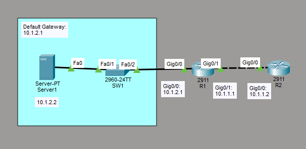

# Configure and Verify NTP
This is a guide to configure and verify NTP on the routers.



List of Devices:
- Routers:
    - Quantity: 2
    - Model Name: 2911
- Switch:
    - Quantity: 1
    - Model Name: 2960
- Server:
	- Quantity: 1
	- Model Name: Server-PT

## IPv4 Address Table for the Routers
R1:
- Interface GigabitEthernet 0/0
	- IPv4 Address: 10.1.2.1
	- Subnet Mask: 255.255.255.0
- Interface GigabitEthernet 0/1
	- IPv4 Address: 10.1.1.1
	- Subnet Mask: 255.255.255.0

R2:
- Interface GigabitEthernet 0/0
	- IPv4 Address: 10.1.1.2
	- Subnet Mask: 255.255.255.0

## IPv4 Address Table for the Server
Server1:
- IPv4 Address: 10.1.2.2
- Subnet Mask: 255.255.255.0
- Default Gateway: 10.1.2.1

## Configure IPv4 Addresses for the Routers
Configure IPv4 addresses on the interfaces of the routers. 

Interface GigabitEthernet 0/0 on R1:
```
R1(config)# int Gig0/0
R1(config-if)# ip add 10.1.2.1 255.255.255.0
R1(config-if)# no shut
R1(config-if)# end
```

Interface GigabitEthernet 0/1 on R1:
```
R1(config)# int Gig0/1
R1(config-if)# ip add 10.1.1.1 255.255.255.0
R1(config-if)# no shut
R1(config-if)# end
```

Interface GigabitEthernet 0/0 on R2:
```
R2(config)# int Gig0/0
R2(config-if)# ip add 10.1.1.2 255.255.255.0
R2(config-if)# no shut
R2(config-if)# end
```

## Configure IPv4 Address for the Server
On Server1, go to Desktop -> IP Configuration. Set the IPv4 Address, Subnet Mask, and Default Gateway according to the *IP Address Table for the Server*.

## Configure NTP
Configure NTP on the routers

Configure the NTP master on R1:
```
R1# conf t
R1(config)# ntp master 2
R1(config)# end
```

Configure the NTP client on R2:
```
R2# conf t
R2(config)# ntp server 10.1.1.1
R2(config)# end
```

## Verify NTP on Client Router
Verify NTP on the client router.

Verify the NTP configuration on R2:
```
R2# show ntp associations
```

Verify the NTP status on R2:
```
R2# show ntp status
```

## Save Router Configurations
For each router, save the running config to the startup config.

Save config for R1:
```
R1# copy run start
```

Save config for R2:
```
R2# copy run start
```