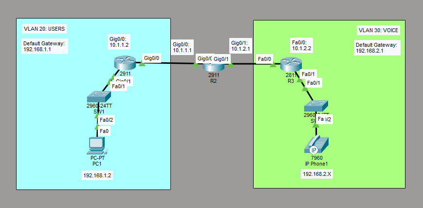

# Configure and Verify VLANs
This is a guide to configure and verify VLANs on the switches.



List of Devices:
- Routers:
	- Quantity: 2
	- Model Name: 2911
- Routers:
	- Quantity: 1
	- Model Name: 2811
- Switches:
	- Quantity: 2
	- Model Name: 2960
- PC:
	- Quantity: 1
	- Model Name: PC-PT
- IP Phone:
	- Quantity: 1
	- Model Name: IP Phone

## IP Address Table for the Routers
R1:
- Interface: GigabitEthernet 0/0
	- IPv4 Address: 10.1.1.2
	- Subnet Mask: 255.255.255.0
- Interface: GigabitEthernet 0/1
	- IPv4 Address: 192.168.1.1
	- Subnet Mask: 255.255.255.0

R2:
- Interface: GigabitEthernet 0/0
	- IPv4 Address: 10.1.1.1
	- Subnet Mask: 255.255.255.0
- Interface: GigabitEthernet 0/1
	- IPv4 Address: 10.1.2.1
	- Subnet Mask: 255.255.255.0

R3:
- Interface: FastEthernet 0/0
	- IPv4 Address: 10.1.2.2
	- Subnet Mask: 255.255.255.0
- Interface: FastEthernet 0/1
	- IPv4 Address: 192.168.2.1
	- Subnet Mask: 255.255.255.0

## IP Address Table for the PC
PC1:
- IPv4 Address: 192.168.1.2
- Subnet Mask: 255.255.255.0
- Default Gateway: 192.168.1.1

## Configure IP Addresses of the Routers
Configure the IP address for the interfaces of the routers.

Interface GigabitEthernet 0/0 on R1:
```
R1> en
R1# conf t
R1(config)# int Gig0/0
R1(config-if)# ip add 10.1.1.2 255.255.255.0
R1(config-if)# no shut
R1(config-if)# end
```

Interface GigabitEthernet 0/1 on R1:
```
R1> en
R1# conf t
R1(config)# int Gig0/1
R1(config-if)# ip add 192.168.1.1 255.255.255.0
R1(config-if)# no shut
R1(config-if)# end
```

Interface GigabitEthernet 0/0 on R2:
```
R2> en
R2# conf t
R2(config)# int Gig0/0
R2(config-if)# ip add 10.1.1.1 255.255.255.0
R2(config-if)# no shut
R2(config-if)# exit
```

Interface GigabitEthernet 0/1 on R2:
```
R2> en
R2# conf t
R2(config)# int Gig0/1
R2(config-if)# ip add 10.1.2.1 255.255.255.0
R2(config-if)# no shut
R2(config-if)# end
```

Interface FastEthernet 0/0 on R3:
```
R3> en
R3# conf t
R3(config)# int Fa0/0
R3(config-if)# ip add 10.1.2.2 255.255.255.0
R3(config-if)# no shut
R3(config-if)# exit
```

Interface FastEthernet 0/1 on R3:
```
R3> en
R3# conf t
R3(config)# int Fa0/1
R3(config-if)# ip add 192.168.2.1 255.255.255.0
R3(config-if)# no shut
R3(config-if)# end
```

## Configure DHCP on the Router
Configure DHCP on R3:
```
R3# conf t
R3(config)# ip dhcp excluded-address 192.168.2.1 192.168.2.10
R3(config)# ip dhcp pool VoicePool
R3(dhcp-config)# network 192.168.2.0 255.255.255.0
R3(dhcp-config)# default-router 192.168.2.1
R3(dhcp-config)# dns-server 192.168.2.1
R3(dhcp-config)# option 150 ip 192.168.2.1
R3(dhcp-config)# exit
```

Configure telephony on R3:
```
R3(config)# telephony-service
R3(config-telephony)# max-dn 5
R3(config-telephony)# max-ephones 5
R3(config-telephony)# ip source-address 192.168.2.1 port 2000
R3(config-telephony)# auto assign 1 to 9
R3(config-telephony)# end
```

## Configure IP Addresses of the PC
On PC1, go to Desktop -> IP Configuration. Set the IPv4 Address, Subnet Mask, and Default Gateway according to the *IP Address Table for the PC*.

## Configure and Verify VLANs for the Switches
Configure and verify the VLANs for the switches. You will create a VLAN called USERS for the PCs and a VLAN called VOICE for the IP Phones.

**SW1**

Show the default VTP status on SW1:
```
SW1> show vtp status
```

Create a VLAN with the name, USERS, on SW1:
```
SW1> en
SW1# conf t
SW1(config)# vlan 20
SW1(config-vlan)# name USERS
SW1(config-vlan)# exit
```

Verify the VLANs on SW1:
```
SW1(config)# do show vlan brief
```

Assign VLANs to the interfaces on SW1.

Interface FastEthernet 0/2 on SW1:
```
SW1(config)# int Fa0/2
SW1(config-if)# switchport mode access
SW1(config-if)# switchport access vlan 20
SW1(config-if)# exit
```

Interface FastEthernet 0/1 on SW1:
```
SW1(config)# int Fa0/1
SW1(config-if)# switchport mode access
SW1(config-if)# switchport access vlan 20
SW1(config-if)# end
```

Verify the VLANs of the interfaces on SW1:
```
SW1# show vlan brief
```

Verify the VLAN for interface Fa0/1 on SW1:
```
SW1# show int Fa0/1 switchport
```

Verify the VLAN for interface Fa0/2 on SW1:
```
SW1# show int Fa0/2 switchport
```

**SW2**

Show the default VTP status on SW2:
```
SW2> show vtp status
```

Create a VLAN with the name, VOICE, on SW2:
```
SW2> en
SW2# conf t
SW2(config)# vlan 30
SW2(config-vlan)# name VOICE
SW2(config-vlan)# exit
```

Verify the VLANs on SW2:
```
SW2(config)# do show vlan brief
```

Assign VLANs to the interfaces on SW2.

Interface FastEthernet 0/2 on SW2:
```
SW2(config)# int Fa0/2
SW2(config-if)# switchport mode access
SW2(config-if)# switchport access vlan 30
SW2(config-if)# switchport voice vlan 1
SW2(config-if)# exit
```

Interface FastEthernet 0/1 on SW2:
```
SW2(config)# int Fa0/1
SW2(config-if)# switchport mode access
SW2(config-if)# switchport access vlan 30
SW2(config-if)# switchport voice vlan 1
SW2(config-if)# end
```

Verify the VLANs of the interfaces on SW2:
```
SW2# show vlan brief
```

Verify the VLAN for interface Fa0/1 on SW2:
```
SW2# show int Fa0/1 switchport
```

Verify the VLAN for interface Fa0/2 on SW2:
```
SW2# show int Fa0/2 switchport
```

## Save Router Configurations

Go to each router and save the running configuration to the startup configuration.

Save the config for R1:
```
R1# copy run start
```

Save the config for R2:
```
R2# copy run start
```

Save the config for R3:
```
R3# copy run start
```

## Save Switch Configurations

Go to each switch and save the running configuration to the startup configuration.

Save the config for SW1:
```
SW1# copy run start
```

Save the config for SW2:
```
SW2# copy run start
```

## Resources
- [Cisco VoIP Phone Configuration Guide - UniNets](https://www.uninets.com/blog/configure-cisco-voip)
- [How to Configure DHCP in Cisco Packet Tracer - SYSNETTECH Solutions](https://www.sysnettechsolutions.com/en/configure-dhcp-in-cisco-packet-tracer/)
- [3.3.12 Packet Tracer – VLAN Configuration (Instructions Answer) - ITExamAnswers.net](https://itexamanswers.net/3-3-12-packet-tracer-vlan-configuration-instructions-answer.html)