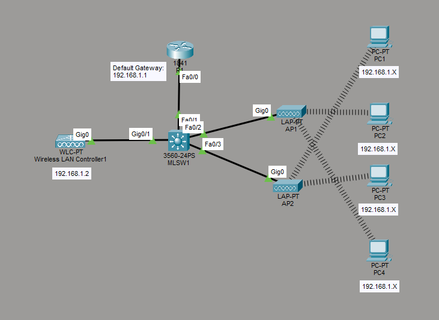

# Configure and Verify Wireless Security
This is a guide to configure and verify wireless security. You will configure the wireless security protocol, WPA2-PSK, in this guide.



List of Devices:
- WLC:
	- Model Name: WLC-PT
	- Quantity: 1
- Router:
	- Model Name 1841
	- Quantity: 1
- Multilayer Switch:
	- Model Name: 3560
	- Quantity: 1
- LAPs:
	- Model Name: LAP-PT
	- Quantity: 2
- PCs:
	- Model Name: PC-PT
	- Quantity: 4

## IP Address Table of the Router
R1:
- Interface: Fa0/0
	- IPv4 Address: 192.168.1.1 
	- Subnet Mask: 255.255.255.0

## Configure an IP Address for the Router
Configure an IP address for the interface of the router.

Interface FastEthernet 0/0 on R1:
```
R1> en
R1# conf t
R1(config)# int Fa0/0
R1(config-if)# ip add 192.168.1.1 255.255.255.0
R1(config-if)# no shut
R1(config-if)# end
```

## Configure DHCP

Create a DHCP pool called Pool0DHCP with the following IP addresses for the network, default-router, and dns-server on R1.
```
R1# conf t
R1(config)# ip dhcp excluded-address 192.168.1.1 192.168.1.10
R1(config)# ip dhcp pool Pool0DHCP
R1(dhcp-config)# network 192.168.1.0 255.255.255.0
R1(dhcp-config)# default-router 192.168.1.1
R1(dhcp-config)# dns-server 192.168.1.1
R1(dhcp-config)# end
```

## Configure WLC Management

On Wireless LAN Contoller1, go to Config -> Management. Set the IPv4 Address, Subnet Mask, and Default Gateway according to the information below:
- IPv4 Address: 192.168.1.2
- Subnet Mask: 255.255.255.0
- Default Gateway: 192.168.1.1

## Configure WPA2-PSK
On Wireless LAN Controller1, go to Config -> Wireless LANs. Create a new WLAN with the following information below:
- Name: Lunalight
- SSID: Lunalight
- Authentication: WPA2-PSK
- PSK Pass Phrase: darkmoon

Click the new button to create the WLAN.

## Setup the Wireless Interface for the PCs
Setup the wireless interface for the PCs.

On each PC, go to Physical. Power off the PC. Remove the interface called PT-HOST-NM-1CFE from the PC. Add a wireless interface called WMP300N to the PC. Power on the PC.

## Connect to the SSID for the PCs
Connect to the SSID for the PCs.

On each PC, go to Config -> Wireless0. Connect to the SSID according to the information below:
- SSID: Lunalight
- Authentication: WPA2-PSK
- PSK Pass Phrase: darkmoon

Under IP configuration, make sure it is set to DHCP. 

## Save Router Configuration
Save the running configuration to the startup configuration for the router.

Save the config for R1:
```
R1# copy run start
```