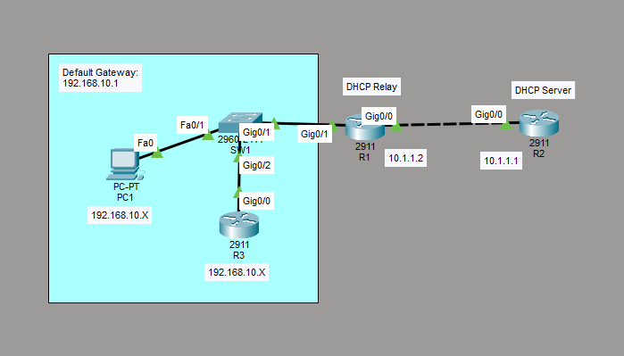

# Configure DHCP Server and Relay for Routers
This is a guide to configure the DHCP server and DHCP relay for the routers.



List of Devices:
- PC:
	- Model Name: PC-PT
	- Quantity: 1
- Switch:
	- Model Name: 2969
	- Quantity: 1
- Router:
	- Model Name: 2911
	- Quantity: 3

## IP Address Table for the Routers
R1:

- GigabitEthernet0/0:
    - IPv4 Address: 10.1.1.2
    - Subnet Mask: 255.255.255.0
- GigabitEthernet1/0:
    - IPv4 Address: 192.168.10.1
    - Subnet Mask: 255.255.255.0

R2:

- GigabitEthernet0/0:
    - IPv4 Address: 10.1.1.1
    - Subnet Mask: 255.255.255.0

R3:

- GigabitEthernet0/0:
    - IPv4 Address: 192.168.10.X (Assigned by DHCP)
    - Subnet Mask: 255.255.255.0

## Configure the IP addresses of the Routers
Configure the IP address for the interfaces of the routers.

Interface Gig0/0 on R2:
```
R2> en
R2# conf t
R2(config)# int Gig0/0
R2(config-if)# ip add 10.1.1.1 255.255.255.0
R2(config-if)# no shut
R2(config-if)# end
```

Interface Gig0/0 on R1:
```
R1> en
R1# conf t
R1(config)# int Gig0/0
R1(config-if)# ip add 10.1.1.2 255.255.255.0
R1(config-if)# no shut
R1(config-if)# exit
```

Interface Gig0/1 on R1:
```
R1(config)# int Gig0/1
R1(config-if)# ip add 192.168.10.1 255.255.255.0
R1(config-if)# no shut
R1(config-if)# end
```

## Configure DHCP for the Router
Configure the DHCP server on R2.

Configure the exclude addresses for DHCP on R2:
```
R2# conf t
R2(config)# ip dhcp excluded-address 192.168.10.1 192.168.10.10
```

Configure the DHCP pool on R2:
```
R2(config)# ip dhcp pool DHCPPool
R2(dhcp-config)# default-router 192.168.10.1
R2(dhcp-config)# dns-server 8.8.8.8
R2(dhcp-config)# network 192.168.10.0 255.255.255.0
R2(dhcp-config)# end
```

Configure the DHCP relay on R1

Interface Gig0/1 on R1:
```
R1# conf t
R1(config)# int Gig0/1
R1(config-if)# ip helper-address 10.1.1.1
R1(config-if)# end
```

## Configure Static Routing
Configure static routing for R2 in order to hand out an IP address to the clients in a different subnet via DHCP:
```
R2(config)# ip route 192.168.10.0 255.255.255.0 10.1.1.2
```

## Configure DHCP Client for the PC
Configure the DHCP client on PC1.

Go to Config -> Settings. Set the Gateway/DNS IPv4 to DHCP. You should be able to get the IP address for the Default Gateway and DNS Server.

## Configure DHCP Client for the Router
Configure the DHCP client on R3.

Interface Gig0/0 on R3:
```
R3> en
R3# conf t
R3(config)# int Gig0/0
R3(config-if)# ip add dhcp
R3(config-if)# no shut
R3(config-if)# end
```

## Verify the Functionality of DHCP
Verify the functionality of DHCP on the server and client.

Verify the DHCP Server on R2:
```
R2# show ip dhcp binding
```

Verify the dynamic address assignment on the DHCP client on R3:
```
R3# show ip int brief
```

## Save Router Configurations
Go to each router and save the running configuration to the startup configuration.

Save the config for R1:
```
R1#copy run start
```

Save the config for R2:
```
R2#copy run start
```

Save the config for R3:
```
R3#copy run start
```

## Resources
- [Configure a Cisco DHCP Server and Relay](https://computingforgeeks.com/cisco-dhcp-server-relay-configuration/)