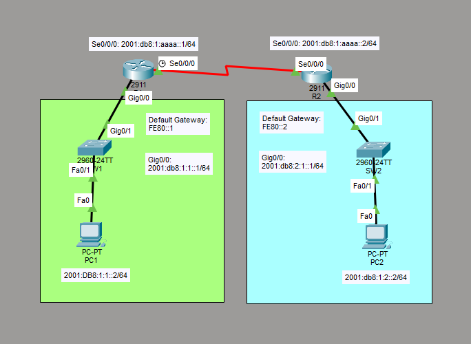

# Configure IPv6 Static Routing

This is a guide to configure IPv6 static routing.



List of Devices:
- Routers
	- Num: 2
	- Model: 2911
- Switches
	- Num: 2
	- Model: 2960-24TT
- PCs
	- Num: 2
	- Model: PC-PT

## IPv6 Address Table for the Routers
R1:
- Interface: GigabitEthernet0/0
	- Global Unicast Address: 2001:db8:1:1::1/64
	- Link-local Address: FE80::1 (Default Gateway)
- Interface: Serial0/0/0
	- IPv6 Address: 2001:db8:1:aaaa::1/64

R2:
- Interface: GigabitEthernet0/0
	- Global Unicast Address: 2001:db8:1:2::1/64
	- Link-local Address: FE80::2 (Default Gateway)
- Interface: Serial0/0/0
	- IPv6 Address: 2001:db8:1:aaaa::2/64

## IPv6 Address Table for the PCs
PC1:
- IPv6 Address: 2001:db8:1:1::2/64
- Default Gateway: FE80::1

PC2:
- IPv6 Address: 2001:db8:1:2::2/64
- Default Gateway: FE80::2


## Configure IPv6 Addresses for the Routers
For each 2911 router, go to the Physical tab. Add the interface, HWIC-2T, to the router. This provides you access to serial ports required for routing.

Configure the IPv6 address for the serial interfaces of the routers.

Interface Se0/0/0 for R1:
```
R1#conf t
R1(config)# ipv6 unicast-routing
R1(config)# int Se0/0/0
R1(config-if)# ipv6 add 2001:db8:1:aaaa::1/64
R1(config-if)# no shut
R1(config-if)# end
```

Interface Gig0/0 for R1:
```
R1# conf t
R1(config)# int Gig0/0
R1(config-if)# ipv6 add 2001:db8:1:1::1/64
R1(config-if)# ipv6 add fe80::1 link-local
R1(config-if)# no shut
R1(config-if)# end
```

Interface Se0/0/0 for R2:
```
R2# conf t
R2(config)# ipv6 unicast-routing
R2(config)# int Se0/0/0
R2(config-if)# ipv6 add 2001:db8:1:aaaa::2/64
R2(config-if)# no shut
R2(config-if)# end
```

Interface Gig0/0 for R2:
```
R2#conf t
R2(config)# int Gig0/0
R2(config-if)# ipv6 add 2001:db8:1:2::1/64
R2(config-if)# ipv6 add fe80::2 link-local
R2(config-if)# no shut
R2(config-if)# end
```

## Configure IPv6 Addresses for the PCs

Configure the IPv6 address for the PCs.
Go to Desktop -> IP Configuration -> IPv6 Configuration.

For each PC, set the IPv6 address and default gateway according to the *IPv6 Address Table for the PCs* above.

## Configure Static IPv6 Routing

Configure static IPv6 routing for the routers.

Routing for R1:
```
R1(config)# ipv6 route 2001:db8:1:2::0/64 Se0/0/0
```

Routing for R2:
```
R2(config)# ipv6 route 2001:db8:1:1::0/64 Se0/0/0
```

## Save Router Configurations

Save the running config to the startup config for the routers.

Saving config for R1:
```
R1#copy running-config startup-config
```

Saving config for R2:
```
R2#copy running-config startup-config
```

## Resources
- [12.6.6 Packet Tracer – Configure IPv6 Addressing (Answers) - ITExamAnswers.net](https://itexamanswers.net/12-6-6-packet-tracer-configure-ipv6-addressing-answers.html)
- [Cisco Packet Tracer Basic Networking - IPV6 Static Routing using 2 routers - Suhag's Cisco and Tech](https://youtu.be/D3ziy42LLfw?is=0aYOdU3CZH6x-Awf)