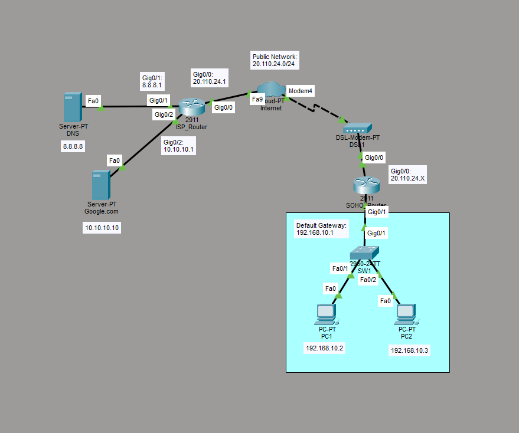

# Configure ISP Network

This is a guide to configure an ISP Network.



List of Devices:
- Router:
	- Model Name: 2911
	- Quantity: 2
- Switch:
	- Model Name: 2960
	- Quantity: 1
- PC:
	- Model Name: PC-PT
	- Quantity: 2
- Server:
	- Model Name: Server-PT
	- Quantity: 2
- Cloud:
	- Model Name: Cloud-PT
	- Quantity: 1
- Modem:
	- Model Name: DSL Modem
	- Quantity: 1

## IP Address Table of the Servers
DNS:
- Default Gateway: 8.8.8.1
- DNS Server: 8.8.8.8
- Interface FastEthernet0:
	- IPv4 Address: 8.8.8.8
	- Subnet Mask: 255.255.255.0

Google.com:
- Default Gateway: 10.10.10.1
- DNS Server: 8.8.8.8
- Interface FastEthernet0:
	- IPv4 Address: 10.10.10.10
	- Subnet Mask: 255.255.255.0

## IP Address Table of the PCs
PC1: 
- IPv4 Address: 192.168.10.2
- Subnet Mask: 255.255.255.0
- Default Gateway: 192.168.10.1
- DNS Server: 8.8.8.8

PC2: 
- IPv4 Address: 192.168.10.3
- Subnet Mask: 255.255.255.0
- Default Gateway: 192.168.10.1
- DNS Server: 8.8.8.8

## Setup the Cloud Device
In Cloud-PT, go to the Physical tab. Power off the device. Add the interface, PT-CLOUD-NM-1CFE, to the device. Power on the device.

In Cloud-PT, go to Config -> DSL. Add the DSL entry according to the information below:
- From Port: Modem4
- To Port: FastEthernet9

## Configure the IP addresses of the Routers
**ISP_Router**

Configure the IP addresses of the interfaces for the ISP_Router.

Interface GigabitEthernet 0/1 on the ISP_Router:
```
ISP_Router> en
ISP_Router# conf t
ISP_Router(config)# int Gig0/1
ISP_Router(config-if)# ip add 8.8.8.1 255.255.255.0
ISP_Router(config-if)# no shut
ISP_Router(config-if)# exit
```

Interface GigabitEthernet 0/2 on the ISP_Router:
```
ISP_Router(config)# int Gig0/2
ISP_Router(config-if)# ip add 10.10.10.1 255.255.255.0
ISP_Router(config-if)# no shut
ISP_Router(config-if)# end
```

Interface GigabitEthernet 0/0 on the ISP_Router:
```
ISP_Router(config)# int Gig0/0
ISP_Router(config-if)# ip add 20.110.24.1 255.255.255.0
ISP_Router(config-if)# no cdp en
ISP_Router(config-if)# no shut
ISP_Router(config-if)# end
```

Configure DHCP on the ISP_Router:
```
ISP_Router(config)# ip dhcp pool DHCPPool
ISP_Router(dhcp-config)# default-router 20.110.24.1
ISP_Router(dhcp-config)# network 20.110.24.0 255.255.255.0
ISP_Router(dhcp-config)# dns-server 8.8.8.8
ISP_Router(dhcp-config)# exit
ISP_Router(config)# ip dhcp excluded-address 20.110.24.1
ISP_Router(config)# end
```

**SOHO_Router**

Configure the IP addresses of the interfaces for the SOHO_Router.

Interface GigabitEthernet 0/1 on the SOHO_Router:
```
SOHO_Router> en
SOHO_Router# conf t
SOHO_Router(config)# int Gig0/1
SOHO_Router(config-if)# ip add 192.168.10.1 255.255.255.0
SOHO_Router(config-if)# no shut
SOHO_Router(config-if)# exit
```

Get IP Address from DHCP for interface GigabitEthernet 0/0 for the SOHO_Router:
```
SOHO_Router(config)# int Gig0/0
SOHO_Router(config-if)# ip add dhcp
SOHO_Router(config-if)# no shut
SOHO_Router(config-if)# exit
```

Configure NAT on the SOHO_Router:
```
SOHO_Router(config)# access-list 1 permit 192.168.10.0 0.0.0.255
SOHO_Router(config)# ip nat inside source list 1 interface Gig0/0

SOHO_Router(config)# int Gig0/1
SOHO_Router(config-if)# ip nat inside
SOHO_Router(config-if)# exit

SOHO_Router(config)# int Gig0/0
SOHO_Router(config-if)# ip nat outside
SOHO_Router(config-if)# end
```

## Configure the IP Addresses for the Servers
**DNS server**

In the DNS server, go to Config -> Settings. Set the Default Gateway and DNS Server according to the IP Address Table of the Servers. 

In the DNS server, go to Config -> FastEthernet0. Set the IPv4 Address and Subnet Mask according to the *IP Address Table of the Servers*.

**Google.com server**

In the Google.com server, go to Config -> Settings. Set the Default Gateway and DNS Server according to the IP Address Table of the Servers. 

## Configure DNS
**DNS server**

In the DNS server, go to Config -> FastEthernet0. Set the IPv4 Address and Subnet Mask according to the *IP Address Table of the Servers*.

In the DNS server, go to Services -> DNS. Add a DNS entry with the following information:
- Name: www.google.com
- Type: A Record
- Address: 10.10.10.10

Add the DNS entry.

## Ensure the HTTP Service is Enabled
**Google.com server**

In the Google.com server, go to Services -> HTTP. Make sure the HTTP service is on.

## Configure the IP Addresses for the PCs
Configure the IPv4 Address, Subnet Mask, Default Gateway, and DNS Server according to the *IP Address Table of the PCs*.

## Modify the HTML content of Google.com
Change the index.html file for the Google.com server. Go to Services -> HTTP -> File Manager. Under File Manager, edit the index.html file.

Modify the index.html file to match the content below. 
```
<html>
<center><font size='+2' color='blue'>Google</font></center>
<hr>Welcome to google.
<p>Quick Links:
<br><a href='helloworld.html'>A small page</a>
<br><a href='copyrights.html'>Copyrights</a>
<br><a href='image.html'>Image page</a>
<br><a href='cscoptlogo177x111.jpg'>Image</a>
</html>
```

## Save Router Configurations
For each router, save the running config to the startup config.

Saving config for ISP_Router:
```
ISP_Router# copy run start
```

Saving config for SOHO_Router:
```
SOHO_Router# copy run start
```

## Resources
- [Connecting Cisco Router to DSL Modem with ISP Configurations - LearnTech Training](https://www.youtube.com/watch?v=MXNM7_Kykaw)
