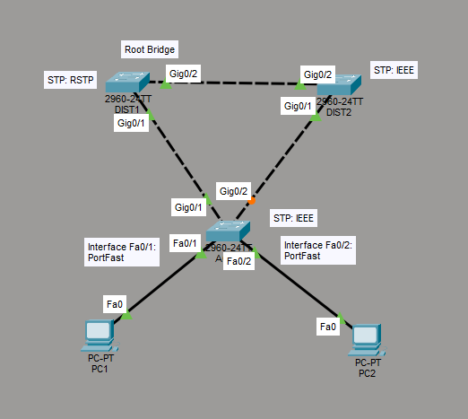

# Configure Rapid PVST+ Spanning Tree Protocol
This is a guide to configure Rapid PVST+ Spanning Tree Protocol on the switch.



List of Devices:
1. PCs
	1. Quantity: 2
	2. Model Name: PC-PT
2. Switch
	1. Quantity: 3
	2. Model Name: 2960

### IP Address Table for the PCs
PC1:
- IPv4 Address: 192.168.1.1
- Subnet Mask: 255.255.255.0

PC2: 
- IPv4 Address: 192.168.1.2
- Subnet Mask: 255.255.255.0

## Verify Spanning Tree Protocol
Verify Spanning Tree Protocol on the switches. 

Verify Spanning Tree Protocol on DIST1:
```
DIST1# show spanning-tree
```

Verify Spanning Tree Protocol on ACC1:
```
ACC1# show spanning-tree
```

Verify Spanning Tree Protocol on DIST2:
```
DIST2# show spanning-tree
```

## Configure the Root Bridge
Configure the Spanning Tree Protocol priority value on DIST1:
```
DIST1# conf t
DIST1(config)# spanning-tree vlan 1 priority 4096
DIST1(config)# end
```

Verify that DIST1 is the new root bridge:
```
DIST1# show spanning-tree
```

The output should mention this information below the address of the root ID: 
```
This bridge is the root
```

## Configure RPVST+
Cisco implements Rapid Spanning Tree Protocol (RSTP) with a VLAN-by-VLAN version called Rapid Per VLAN Spanning Tree Plus (RPVST+). You will configure RPVST+ on a switch.

Configure a switch for RPVST+ on DIST1:
```
DIST1# conf t
DIST1(config)# spanning-tree mode rapid-pvst
DIST1(config)# end
```

Verify RPVST+ on DIST1:
```
DIST1# show spanning-tree
```

The output should mention this information below VLAN0001 on DIST1:
```
VLAN0001
  Spanning tree enabled protocol rstp
```

## Configure PortFast
The PortFast feature is used on ports connected to servers and workstations. PortFast should not be used on ports that connect to switches because it can cause switching loops.

Configure PortFast on interface Fa0/1 on ACC1:
```
ACC1# conf t
ACC1(config)# interface Fa0/1
ACC1(config-if)# spanning-tree portfast
ACC1(config-if)# exit
```

Configure PortFast on interface Fa0/2 on ACC1:
```
ACC1(config)# interface Fa0/2
ACC1(config-if)# spanning-tree portfast
ACC1(config-if)# end
```

### Configure IP Address for the PCs
Configure the IP address for the PCs.

Go to Desktop -> IP Configuration. Set the IPv4 Address and Subnet Mask according to the *IP Address Table for the PCs*.

### Save Switch Configurations
Go to each switch and save the running configuration to the startup configuration.

Save the config for ACC1:
```
ACC1# copy run start
```

Save the config for DIST1:
```
DIST1# copy run start
```

Save the config for DIST2:
```
DIST2# copy run start
```

## Resources
- [3.3.2.2 Packet Tracer – Configuring Rapid PVST Instructions Answers - ITExamAnswers.net](https://itexamanswers.net/3-3-2-2-packet-tracer-configuring-rapid-pvst.html)
- [Configure Spanning Tree Protocol (Rapid PVST+) on Cisco Switches - ComputingForGeeks](https://computingforgeeks.com/cisco-spanning-tree-protocol-configuration/)
- [Configuring Rapid PVST+ - Cisco](https://www.cisco.com/en/US/docs/switches/datacenter/nexus5000/sw/configuration/guide/cli_rel_4_1/Cisco_Nexus_5000_Series_Switch_CLI_Software_Configuration_Guide_chapter11.pdf)
- [Spanning Tree Protocol - Wikipedia](https://en.wikipedia.org/wiki/Spanning_Tree_Protocol)