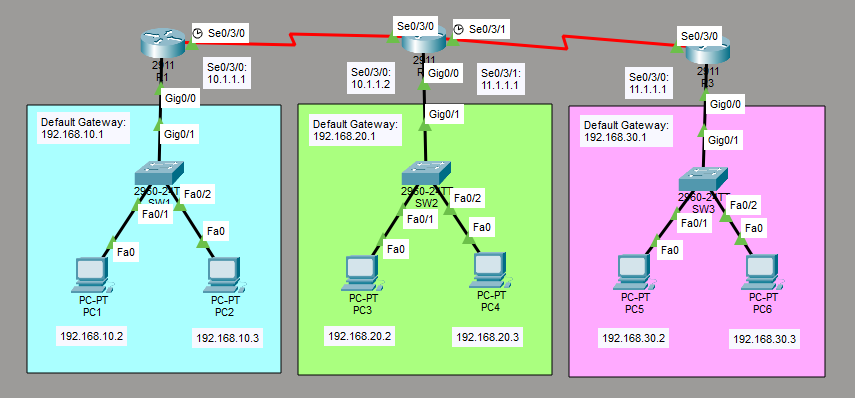

# Configure RIPv2 Routing

This is a guide to configure RIPv2 routing.



List of Devices:
- PC:
	- Model Name: PC-PT
	- Quantity: 6
- Switch:
	- Model Name: 2960
	- Quantity: 3
- Router:
	- Model Name: 2911
	- Quantity: 3

## IP Address Table for the PCs
PC1:
- IP Address: 192.168.10.2
- Subnet Mask: 255.255.255.0
- Default Gateway: 192.168.10.1

PC2:
- IP Address: 192.168.10.3
- Subnet Mask: 255.255.255.0
- Default Gateway: 192.168.10.1

PC3:
- IP Address: 192.168.20.2
- Subnet Mask: 255.255.255.0
- Default Gateway: 192.168.20.1

PC4:
- IP Address: 192.168.20.3
- Subnet Mask: 255.255.255.0
- Default Gateway: 192.168.20.1

PC5:
- IP Address: 192.168.30.2
- Subnet Mask: 255.255.255.0
- Default Gateway: 192.168.30.1

PC6:
- IP Address: 192.168.30.3
- Subnet Mask: 255.255.255.0
- Default Gateway: 192.168.30.1

## IP Address Table for the Routers
R1:
- Interface: Serial0/3/0
	- IP Address: 10.1.1.1
	- Subnet Mask: 255.255.255.0
- Interface: GigabitEthernet0/0
	- IP Address: 192.168.10.1
	- Subnet Mask: 255.255.255.0

R2:
- Interface: Serial0/3/0
	- IP Address: 10.1.1.2
	- Subnet Mask: 255.255.255.0
- Interface: Serial0/3/1
	- IP Address: 11.1.1.1
	- Subnet Mask: 255.255.255.0
- Interface: GigabitEthernet0/0
	- IP Address: 192.168.20.1
	- Subnet Mask: 255.255.255.0

R3:
- Interface: Serial0/3/0
	- IP Address: 11.1.1.2
	- Subnet Mask: 255.255.255.0
- Interface: GigabitEthernet0/0
	- IP Address: 192.168.30.1
	- Subnet Mask: 255.255.255.0

## Configure IP Addresses for the Routers
Configure the IP addresses for the interfaces of the routers.

For each 2911 router, go to the Physical tab. Add the interface, HWIC-2T, to the router. This provides you access to serial ports required for routing.

Interface Serial0/3/0 for R1:
```
R1> en
R1# conf t
R1(config)# int Se0/3/0
R1(config-if)# ip add 10.1.1.1 255.255.255.0
R1(config-if)# no shut
R1(config-if)# exit
```

Interface GigabitEthernet0/0 for R1:
```
R1(config)# int Gig0/0
R1(config-if)# ip add 192.168.10.1 255.255.255.0
R1(config-if)# no shut
R1(config-if)# end
```

Interface Serial0/3/0 for R2:
```
R2> en
R2# conf t
R2(config)# int Se0/3/0
R2(config-if)# ip add 10.1.1.2 255.255.255.0
R2(config-if)# no shut
R2(config-if)# exit
```

Interface Serial0/3/1 for R2:
```
R2(config)# int Se0/3/1
R2(config-if)# ip add 11.1.1.1 255.255.255.0
R2(config-if)# no shut
R2(config-if)# exit
```

Interface GigabitEthernet0/0 for R2:
```
R2(config)# int Gig0/0
R2(config-if)# ip add 192.168.20.1 255.255.255.0
R2(config-if)# no shut
R2(config-if)# end
```

Interface Serial0/3/0 for R3:
```
R3> en
R3# conf t
R3(config)# int Se0/3/0
R3(config-if)# ip add 11.1.1.2 255.255.255.0
R3(config-if)# no shut
R3(config-if)# exit
```

Interface GigabitEthernet0/0 for R3:
```
R3(config)# int Gig0/0
R3(config-if)# ip add 192.168.30.1 255.255.255.0
R3(config-if)# no shut
R3(config-if)# end
```

## Configure Dynamic Routing via RIPv2
Configure dynamic routes via RIPv2 for the routers.

Configure RIPv2 on R1:
```
R1# conf t
R1(config)# router rip
R1(config-router)# version 2
R1(config-router)# network 192.168.10.0
R1(config-router)# network 10.1.1.0
R1(config-router)# end
```

Configure RIPv2 on R2:
```
R2# conf t
R2(config)# router rip
R2(config-router)# version 2
R2(config-router)# network 192.168.20.0
R2(config-router)# network 10.1.1.0
R2(config-router)# network 11.1.1.0
R2(config-router)# end
```

Configure RIPv2 on R3:
```
R3# conf t
R3(config)# router rip
R3(config-router)# version 2
R3(config-router)# network 192.168.30.0
R3(config-router)# network 11.1.1.0
R3(config-router)# end
```

## Configure IP Addresses for the PCs
Configure the IP addresses for the PCs.

Go to Desktop -> IP Configuration

Set the IPv4 Address, Subnet Mask, Default Gateway for each PC according to the *IP Addressing Table for the PCs* given above.

## Save Router Configurations
Go to each router and save the running configuration to the startup configuration.

Save the config for R1:
```
R1# copy run start
```

Save the config for R2:
```
R2# copy run start
```

Save the config for R3:
```
R3# copy run start
```

## Resources
- [RIP Routing Configuration Using 3 Routers in Cisco Packet Tracer - GeeksforGeeks](https://www.geeksforgeeks.org/computer-networks/rip-routing-configuration-using-3-routers-in-cisco-packet-tracer/)
- [Configuring RIPv2 - Study CCNA](https://study-ccna.com/configuring-ripv2/)