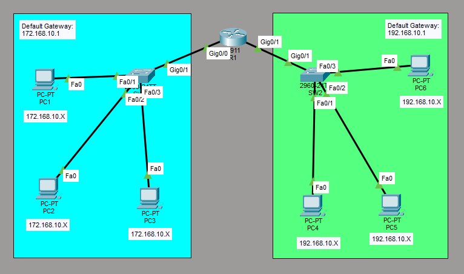

# Configure Router as DHCP Server

This is a guide to configure the router as a DHCP server.



List of Devices:
- PC:
	- Model Name: PC-PT
	- Quantity: 6
- Switch:
	- Model Name: 2960
	- Quantity: 2
- Router:
	- Model Name: 2911
	- Quantity: 1

## IP Address Table for the Routers
R1:
- GigabitEthernet0/0: 
    - IPv4 Address: 172.168.10.1
    - Subnet Mask: 255.255.255.0
- GigabitEthernet0/1:
    - IPv4 Address: 192.168.10.1
    - Subnet Mask: 255.255.255.0

## Configure IP Addresses for the Router
Configure the IP address for the interfaces of the routers.

Interface GigabitEthernet0/0 for R1:
```
R1> en
R1# conf t
R1(config)# int Gig0/0
R1(config-if)# ip add 172.168.10.1 255.255.255.0
R1(config-if)# no shut
R1(config-if)# exit
```

Interface GigabitEthernet0/1 for R1:
```
R1(config)# int Gig0/1
R1(config-if)# ip add 192.168.10.1 255.255.255.0
R1(config-if)# no shut
R1(config-if)# end
```

## Configure DHCP for the Router
Configure DHCP on R1.

Create a DHCP pool called `Pool0DHCP` with the following IP addresses for the network, default-router, and dns-server on R1:
```
R1# conf t
R1(config)# ip dhcp excluded-address 172.168.10.1 172.168.10.10
R1(config)# ip dhcp pool Pool0DHCP
R1(dhcp-config)# network 172.168.10.0 255.255.255.0
R1(dhcp-config)# default-router 172.168.10.1
R1(dhcp-config)# dns-server 172.168.10.1
R1(dhcp-config)# exit
```

Create another DHCP pool called `Pool1DHCP` with the following IP addresses for the network, default-router, and dns-server on R1:
```
R1(config)# ip dhcp excluded-address 192.168.10.1 192.168.10.10
R1(config)# ip dhcp pool Pool1DHCP
R1(dhcp-config)# network 192.168.10.0 255.255.255.0
R1(dhcp-config)# default-router 192.168.10.1
R1(dhcp-config)# dns-server 192.168.10.1
R1(dhcp-config)# end
```

## Enable DHCP for the PCs
Configure the PCs and change the IP configuration.
1. To assign an IP address in PC1, click on PC1.
2. Go to "Desktop" -> "IP configuration" and you will find the IPv4 configuration.
3. Change its state from static to DHCP.
4. It should automatically fetch the data and configure itself.
5. Repeat the same steps with the other PCs.

## Save Router Configuration
Go to R1 and save the running configuration to the startup configuration.
```
R1# copy run start
```

## Resource
- [Configure Cisco router as DHCP server - study-ccna.com](https://study-ccna.com/configure-cisco-router-as-dhcp-server/)