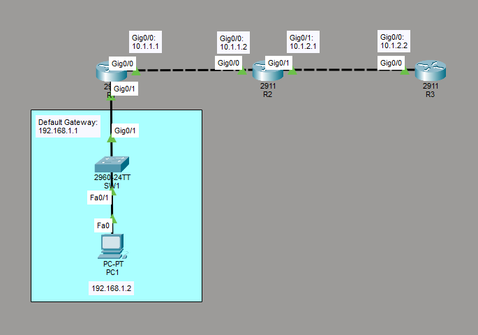

# Configure SSH
This is a guide to configure SSH on the routers.



List of Devices:
- Routers:
	- Quantity: 3
	- Model Name: 2911
- Switches:
	- Quantity: 1
	- Model Name: 2960
- PCs:
	- Quantity: 1
	- Model Name: PC-PT

## IP Address Table for the Routers
R1:
- Interface GigabitEthernet 0/0
	- IPv4 Address: 10.1.1.1
	- Subnet Mask: 255.255.255.0
- Interface GigabitEthernet 0/1
	- IPv4 Address: 192.168.1.1
	- Subnet Mask: 255.255.255.0

R2:
- Interface GigabitEthernet 0/0
	- IPv4 Address: 10.1.1.2
	- Subnet Mask: 255.255.255.0
- Interface GigabitEthernet 0/1
	- IPv4 Address: 10.1.2.1
	- Subnet Mask: 255.255.255.0

R3:
- Interface GigabitEthernet 0/0
	- IPv4 Address: 10.1.2.2
	- Subnet Mask: 255.255.255.0

## IP Address Table for PC
PC1:
- IPv4 Address: 192.168.1.2
- Subnet Mask: 255.255.255.0
- Default Gateway: 192.168.1.1

## Configure IP Addresses for Routers
Configure the IP address for the interfaces of the routers.

Interface GigabitEthernet 0/0 on R1:
```
R1> en
R1# conf t
R1(config)# int Gig0/0
R1(config-if)# ip add 10.1.1.1 255.255.255.0
R1(config-if)# exit
```

Interface GigabitEthernet 0/1 on R1:
```
R1> en
R1# conf t
R1(config)# int Gig0/1
R1(config-if)# ip add 192.168.1.1 255.255.255.0
R1(config-if)# end
```

Interface GigabitEthernet 0/0 on R2:
```
R2> en
R2# conf t
R2(config)# int Gig0/0
R2(config-if)# ip add 10.1.1.2 255.255.255.0
R2(config-if)# exit
```

Interface GigabitEthernet 0/1 on R2:
```
R2> en
R2# conf t
R2(config)# int Gig0/1
R2(config-if)# ip add 10.1.2.1 255.255.255.0
R2(config-if)# end
```

Interface GigabitEthernet 0/0 on R3:
```
R3> en
R3# conf t
R3(config)# int Gig0/0
R3(config-if)# ip add 10.1.2.2 255.255.255.0
R3(config-if)# exit
```

## Configure Static Routing
Configure static routing for the routers.

Configure a static route for R1:
```
R1> en
R1# conf t
R1(config)# ip route 10.1.2.0 255.255.255.0 10.1.1.2
```

Configure a static route for R2:
```
R2> en
R2# conf t
R2(config)# ip route 192.168.1.0 255.255.255.0 10.1.1.1
```

Configure static routes for R3:
```
R3> en
R3# conf t
R3(config)# ip route 10.1.1.0 255.255.255.0 10.1.2.1
R3(config)# ip route 192.168.1.0 255.255.255.0 10.1.2.1
```

## Configure IP Address for PC
Configure the IP address for the PC.

Go to Desktop -> IP Configuration. Set the IPv4 Address, Subnet Mask, and Default Gateway according to the *IP Address Table for PC*.

## Configure SSH for Routers
Configure SSH for the routers.

Configure SSH on R1.

Set the hostname and domain name for R1:
```
R1> en
R1# conf t
R1(config)# hostname R1
R1(config)# ip domain-name cisco.com
```

Create RSA keys of 768 bits in size:
```
R1(config)# crypto key generate rsa
How many bits in the modulus [512]: 768
```

Ensure SSH is the only supported method:
```
R1(config)# line vty 0 4
R1(config-line)# transport input ssh
R1(config-line)# exit
```

Ensure that the SSH version is 2 on R1:
```
R1(config)# ip ssh version 2
```

Configure SSH on R2.

Set the hostname and domain name for R2:
```
R2> en
R2# conf t
R2(config)# hostname R2
R2(config)# ip domain-name cisco.com
```

Create RSA keys of 768 bits in size:
```
R2(config)# crypto key generate rsa
How many bits in the modulus [512]: 768
```

Ensure SSH is the only supported method:
```
R2(config)# line vty 0 4
R2(config-line)# transport input ssh
R2(config-line)# exit
```

Ensure that the SSH version is 2 on R2:
```
R2(config)# ip ssh version 2
```

Configure SSH on R3.

Set the hostname and domain name for R3:
```
R3> en
R3# conf t
R3(config)# hostname R2
R3(config)# ip domain-name cisco.com
```

Create RSA keys of 768 bits in size:
```
R3(config)# crypto key generate rsa
How many bits in the modulus [512]: 768
```

Ensure SSH is the only supported method:
```
R3(config)# line vty 0 4
R3(config-line)# transport input ssh
R3(config-line)# exit
```

Ensure that the SSH version is 2 on R3:
```
R3(config)# ip ssh version 2
```

## Test SSH Connections
Test the SSH connections from the PC to the routers. You will test the SSH connections on PC1.

Go to Desktop -> Command Prompt

Test the SSH connection to R1:
```
C:\> ssh -l R1 192.168.1.1
```

Test the SSH connection to R2:
```
C:\> ssh -l R2 10.1.1.2
```

Test the SSH connection to R2:
```
C:\> ssh -l R3 10.1.2.2
```

## Save Router Configurations
Save the running config to the startup config for the routers.

Saving config for R1:
```
R1# copy run start
```

Saving config for R2:
```
R2# copy run start
```

Saving config for R3:
```
R3# copy run start
```

## Resources
- [IP Domain-name Command on CISCO Router/Switch - ITExamAnswers.net](https://itexamanswers.net/ip-domain-name-command-on-cisco-router-switch.html)
- [Configure SSH on Routers - Cisco Systems, Inc.](https://www.cisco.com/c/en/us/support/docs/security-vpn/secure-shell-ssh/4145-ssh.html)