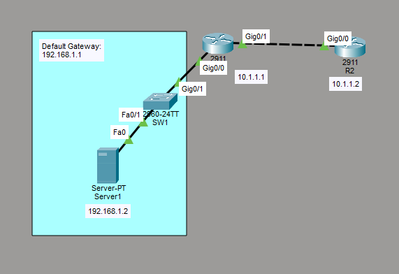

# Configure Syslog
This is a guide to configure syslog.



## IP Address Table for the Routers
R1:
- Interface: GigabitEthernet 0/0
	- IPv4 Address: 192.168.1.1
    - Subnet Mask: 255.255.255.0
- Interface: GigabitEthernet 0/1
	- IPv4 Address: 10.1.1.1
    - Subnet Mask: 255.255.255.0

R2:
- Interface: GigabitEthernet 0/0
	- IPv4 Address: 10.1.1.2
    - Subnet Mask: 255.255.255.0

## IP Address Table for the Server
Server1:
- IPv4 Address: 192.168.1.2
- Subnet Mask: 255.255.255.0
- Default Gateway: 192.168.1.1

## Configure IP Addresses of the Routers
Interface GigabitEthernet 0/0 on R1:
```
R1# conf t
R1(config)# int Gig0/0
R1(config-if)# ip add 192.168.1.1 255.255.255.0
```

Interface GigabitEthernet 0/1 on R1:
```
R1# conf t
R1(config)# int Gig0/1
R1(config-if)# ip add 10.1.1.1 255.255.255.0
```

Interface GigabitEthernet 0/0 on R2:
```
R2# conf t
R2(config)# int Gig0/0
R2(config-if)# ip add 10.1.1.2 255.255.255.0
```

## Configure IP Address of the Server
On Server1, go to Desktop -> IP Configuration. Set the IPv4 Address, Subnet Mask, and Default Gateway according to the *IP Address Table for the Server*.

## Ensure Syslog is Enabled on Server
On Server1, go to Services -> SYSLOG. Make sure the Syslog service is on.

## Configure Routing for the Router
Configure static routing for R2:
```
R2# conf t
R2(config)# ip route 192.168.1.0 255.255.255.0 10.1.1.1
R2(config)# end
```

## Configure Syslog on the Routers
Configure Syslog on R1:
```
R1# conf t
R1(config)# logging host 192.168.1.2
R1(config)# logging trap debugging
R1(config)# end
```

Configure Syslog on R2:
```
R2# conf t
R2(config)# logging host 192.168.1.2
R2(config)# logging trap debugging
R2(config)# end
```

## View Syslog Messages on the Server
Enter the following commands on the routers to generate log messages:

R1:
```
R1# conf t
R1(config)# int Gig0/2
R1(config-if)# no shut
R1(config-if)# shut
```

R2:
```
R2# conf t
R2(config)# int Gig0/1
R2(config-if)# no shut
R2(config-if)# shut
```

## Display the State of Logging
Display the state of logging for R1:
```
R1# show logging
```

Display the state of logging for R2:
```
R2# show logging
```

## Save Router Configurations
Go to each router and save the running configuration to the startup configuration.

Save the config for R1:
```
R1#copy run start
```

Save the config for R2:
```
R2#copy run start
```

## Resources
- [How to Configure Syslog Server in Packet Tracer](https://netizzan.com/how-to-configure-syslog-server-in-packet-tracer/)
- [show logging - Cisco](https://www.cisco.com/E-Learning/bulk/public/tac/cim/cib/using_cisco_ios_software/cmdrefs/show_logging.htm)