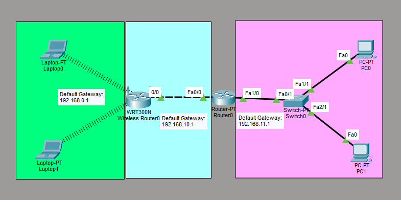

# Configure a Wireless Network

This is a guide to configure a wireless network.



List of Devices:
- PC:
	- Model Name: PC-PT
	- Quantity: 2
- Switch:
	- Model Name: Switch-PT
	- Quantity: 1
- Router:
	- Model Name: Router-PT
	- Quantity: 1
- Wireless Router:
	- Model Name: WRT300N
	- Quantity: 1
- Laptop:
	- Model Name: Laptop-PT
	- Quantity: 2

## IP Address Table for the PCs
PC0:
- IP Address: 192.168.11.2
- Subnet Mask: 255.255.255.0
- Default Gateway: 192.168.11.1

PC1:
- IP Address: 192.168.11.3
- Subnet Mask: 255.255.255.0
- Default Gateway: 192.168.11.1

## IP Address Table for the Laptops
Laptop0:
- IP Address: 192.168.0.2
- Subnet Mask: 255.255.255.0
- Default Gateway: 192.168.0.1

Laptop1:
- IP Address: 192.168.0.3
- Subnet Mask: 255.255.255.0
- Default Gateway: 192.168.0.1

## IP Address Table for the Routers
Router0:
- FastEthernet0/0
	- IP Address: 192.168.10.1
	- Subnet Mask: 255.255.255.0
- FastEthernet1/0
	- IP Address: 192.168.11.1
	- Subnet Mask: 255.255.255.0

Wireless Router0:
- Internet
	- IP Configuration: Static
	- IPv4 Address: 192.168.10.2
	- Subnet Mask: 255.255.255.0
	- Default Gateway: 192.168.10.1
- LAN
	- IPv4 Address: 192.168.0.1
	- Subnet Mask: 255.255.255.0

## Configure IP Addresses for the Routers

Configure the IP addresses of the interfaces for Router0

Interface FastEthernet0/0 for Router0:
```
Router> enable
Router# conf t
Router(config)# interface fastethernet 0/0
Router(config-if)# ip address 192.168.10.1 255.255.255.0
Router(config-if)# no shutdown
Router(config-if)# exit
```

Interface FastEthernet1/0 for Router0:
```
Router> enable
Router# conf t
Router(config)# interface fastethernet 1/0
Router(config-if)# ip address 192.168.11.1 255.255.255.0
Router(config-if)# no shutdown
Router(config-if)# exit
```

Configure the interfaces of Wireless Router0 according to the *IP Address Table for the Routers*.

## Configure IP Addresses for the PCs
Configure the IP addresses for the PCs according to the *IP Address Table for the PCs*.

## Configure IP Addresses for the Laptops
Power off the laptop. Replace the laptop's interface, PT-LAPTOP-NM-1CFE, with a wireless interface. Power on the laptop.
Repeat the same steps for the other laptops.

Configure the IP addresses for the laptops according to the *IP Address Table for the Laptops*.

## Save Router Configuration
Go to Router0 and save the running configuration to the startup configuration.
```
Router#copy running-config startup-config
```

## Resource
- [How to connect wireless router with tablet , pc, by Cisco Packet tracer - ABU SAYED](https://www.youtube.com/watch?v=0ps6h9lf_i8)