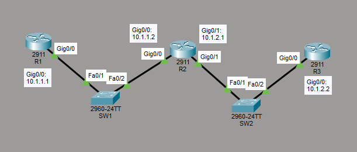

# IPv4 Address Configuration and Verification
This is a guide to configure and verify IPv4 addressing.



List of Devices:
- Routers:
    - Quantity: 3
    - Model Name: 2911
- Switches
    - Quantity: 2
    - Model Name: 2960

## IPv4 Address Table for Routers
R1:
- Interface GigabitEthernet 0/0
	- IPv4 Address: 10.1.1.1
	- Subnet Mask: 255.255.255.0

R2:
- Interface GigabitEthernet 0/0
	- IPv4 Address: 10.1.1.2
	- Subnet Mask: 255.255.255.0
- Interface GigabitEthernet 0/1
	- IPv4 Address: 10.1.2.1
	- Subnet Mask: 255.255.255.0

R3:
- Interface GigabitEthernet 0/0
	- IPv4 Address: 10.1.2.2
	- Subnet Mask: 255.255.255.0

## Configure IPv4 Addresses for the Routers

Configure IPv4 addresses on the interfaces of the routers. 

Interface GigabitEthernet 0/0 on R1:
```
R1(config)# int Gig0/0
R1(config-if)# ip add 10.1.1.1 255.255.255.0
R1(config-if)# no shut
R1(config-if)# end
```

Interface GigabitEthernet 0/0 on R2:
```
R2(config)# int Gig0/0
R2(config-if)# ip add 10.1.1.2 255.255.255.0
R2(config-if)# no shut
R2(config-if)# end
```

Interface GigabitEthernet 0/1 on R2:
```
R2(config)# int Gig0/1
R2(config-if)# ip add 10.1.2.1 255.255.255.0
R2(config-if)# no shut
R2(config-if)# end
```

Interface GigabitEthernet 0/0 on R3:
```
R3(config)# int Gig0/0
R3(config-if)# ip add 10.1.2.2 255.255.255.0
R3(config-if)# no shut
R3(config-if)# end
```

## Verify IPv4 Addresses

Get a quick list of the IPv4 addresses assigned to all the interfaces on R1:
```
R1# show ip interface brief
```

Get detailed listing of the IP related characteristics of the interface GigabitEthernet 0/0 on R1:
```
R1# show ip interface Gig0/0
```

Get a quick list of the IPv4 addresses assigned to all the interfaces on R2:
```
R2# show ip interface brief
```

Get detailed listing of the IP related characteristics of the interface GigabitEthernet 0/0 on R2:
```
R2# show ip interface Gig0/0
```

Get detailed listing of the IP related characteristics of the interface GigabitEthernet 0/1 on R2:
```
R2# show ip interface Gig0/1
```

Get a quick list of the IPv4 addresses assigned to all the interfaces on R3:
```
R3# show ip interface brief
```

Get detailed listing of the IP related characteristics of the interface GigabitEthernet 0/0 on R3:
```
R3# show ip interface Gig0/0
```

## Save Router Configurations
For each router, save the running config to the startup config.

Saving config for R1:
```
R1#copy running-config startup-config
```

Saving config for R2:
```
R2#copy running-config startup-config
```

Saving config for R3:
```
R3#copy running-config startup-config
```

## Resources
- [show ip interface command - Cisco](https://www.cisco.com/E-Learning/bulk/public/tac/cim/cib/using_cisco_ios_software/cmdrefs/show_ip_interface.htm)
