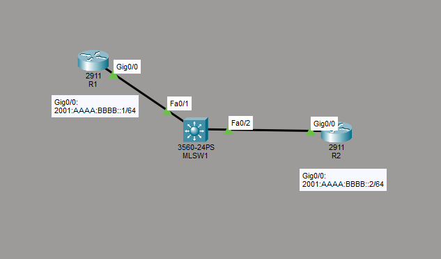

# IPv6 Address Configuration and Verification
This is a guide to configure and verify IPv6 addressing.



List of Devices:
- Routers:
    - Quantity: 2
    - Model Name: 2911
- Multilayer Switch
    - Quantity: 1
    - Model Name: 3560

## IPv6 Address Table for Routers
R1:
- Interface GigabitEthernet 0/0
	- IPv6 Address: 2001:AAAA:BBBB::1/64

R2:
- Interface GigabitEthernet 0/0
	- IPv6 Address: 2001:AAAA:BBBB::2/64

## Configure IPv6 Addresses for the Routers
Configure IPv6 addresses on the interfaces of the routers.

Interface GigabitEthernet 0/0 on R1:
```
R1(config)# int Gig0/0
R1(config-if)# ipv6 add 2001:aaaa:bbbb::1/64
R1(config-if)# no shut
R1(config-if)# end
```

Interface GigabitEthernet 0/0 on R2:
```
R2(config)# int Gig0/0
R2(config-if)# ipv6 add 2001:aaaa:bbbb::2/64
R2(config-if)# no shut
R2(config-if)# end
```

## Verify IPv6 Addresses
Verify the IPv6 addresses on the interfaces of the routers.

Get a quick list of the IPv6 addresses assigned to all the interfaces on R1:
```
R1# show ipv6 interface brief
```

Get detailed listing of the IP related characteristics of the interface GigabitEthernet 0/0 on R1:
```
R1# show ipv6 interface Gig0/0
```

Get a quick list of the IPv6 addresses assigned to all the interfaces on R2:
```
R2# show ipv6 interface brief
```

Get detailed listing of the IP related characteristics of the interface GigabitEthernet 0/0 on R2:
```
R2# show ipv6 interface Gig0/0
```

## Save Router Configurations
For each router, save the running config to the startup config.

Saving config for R1:
```
R1# copy run start
```

Saving config for R2:
```
R2# copy run start
```

## Resources
- [show ip interface command - Cisco](https://www.cisco.com/E-Learning/bulk/public/tac/cim/cib/using_cisco_ios_software/cmdrefs/show_ip_interface.htm)