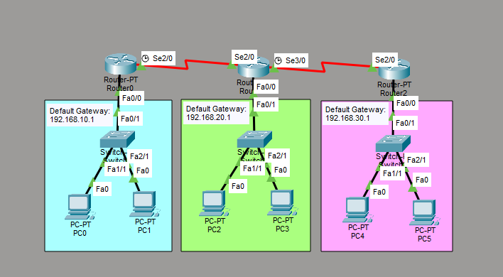

# RIPv2 Routing Configuration

This is a guide to configure RIPv2 routing.



**Step 1:** Place the devices in the Logical topology given below.

List of Devices:
- PC:
	- Model Name: PC-PT
	- Quantity: 6
- Switch:
	- Model Name: Switch-PT
	- Quantity: 3
- Router:
	- Model Name: Router-PT
	- Quantity: 3

IP Address Table for PCs:
- PC0:
	- IP Address: 192.168.10.2
	- Subnet Mask: 255.255.255.0
	- Default Gateway: 192.168.10.1
- PC1:
	- IP Address: 192.168.10.3
	- Subnet Mask: 255.255.255.0
	- Default Gateway: 192.168.10.1
- PC2:
	- IP Address: 192.168.20.2
	- Subnet Mask: 255.255.255.0
	- Default Gateway: 192.168.20.1
- PC3:
	- IP Address: 192.168.20.3
	- Subnet Mask: 255.255.255.0
	- Default Gateway: 192.168.20.1
- PC4:
	- IP Address: 192.168.30.2
	- Subnet Mask: 255.255.255.0
	- Default Gateway: 192.168.30.1
- PC5:
	- IP Address: 192.168.30.3
	- Subnet Mask: 255.255.255.0
	- Default Gateway: 192.168.30.1

**Step 2**: Configure the IP Addressing for the PCs.

Go to Desktop -> IP Configuration

Set the IPv4 Address, Subnet Mask, Default Gateway for each PC according to the *IP Addressing Table for the PCs* given above.

**Step 3**: Configure the IP addressing for the router's interfaces.

IP Address Table for Routers:
- Router0:
	- Interface: Serial2/0
		- IP Address: 10.0.0.1
		- Subnet Mask: 255.0.0.0
	- Interface: FastEthernet0/0
		- IP Address: 192.168.10.1
		- Subnet Mask: 255.255.255.0
- Router1:
	- Interface: Serial2/0
		- IP Address: 10.0.0.2
		- Subnet Mask: 255.0.0.0
	- Interface: Serial3/0
		- IP Address: 11.0.0.1
		- Subnet Mask: 255.0.0.0
	- Interface: FastEthernet0/0
		- IP Address: 192.168.20.1
		- Subnet Mask: 255.255.255.0
- Router2:
	- Interface: Serial2/0
		- IP Address: 11.0.0.2
		- Subnet Mask: 255.0.0.0
	- Interface: FastEthernet0/0
		- IP Address: 192.168.30.1
		- Subnet Mask: 255.255.255.0

Interface Serial2/0 for Router0:
```
Would you like to enter the initial configuration dialog? [yes/no]: no
Router> enable
Router# conf t
Router(config)# interface serial 2/0
Router(config-if)# ip address 10.0.0.1 255.0.0.0
Router(config-if)# no shut
Router(config-if)# exit
```

Interface FastEthernet0/0 for Router0:
```
Router(config)# interface fastethernet 0/0
Router(config-if)# ip address 192.168.10.1 255.255.255.0
Router(config-if)# no shut
Router(config-if)# exit
```

Interface Serial2/0 for Router1:
```
Router(config)# interface serial 2/0
Router(config-if)# ip address 10.0.0.2 255.0.0.0
Router(config-if)# no shut
Router(config-if)# exit
```

Interface Serial3/0 for Router1:
```
Router(config)# interface serial 3/0
Router(config-if)# ip address 11.0.0.1 255.0.0.0
Router(config-if)# no shut
Router(config-if)# exit
```

Interface FastEthernet0/0 for Router1:
```
Router(config)# interface fastethernet 0/0
Router(config-if)# ip address 192.168.20.1 255.255.255.0
Router(config-if)# no shut
Router(config-if)# exit
```

Interface Serial2/0 for Router2:
```
Router(config)# interface serial 2/0
Router(config-if)# ip address 11.0.0.2 255.0.0.0
Router(config-if)# no shut
Router(config-if)# exit
```

Interface FastEthernet0/0 for Router2:
```
Router(config)# interface fastethernet 0/0
Router(config-if)# ip address 192.168.30.1 255.255.255.0
Router(config-if)# no shut
Router(config-if)# exit
```

**Step 4**: Configure the dynamic routes to the routers.

Router0:
```
Router# conf t
Router(config)# router rip
Router(config-router)# version 2
Router(config-router)# network 192.168.10.0
Router(config-router)# network 10.0.0.0
Router(config-router)# exit
```

Router1:
```
Router(config)# router rip
Router(config-router)# version 2
Router(config-router)# network 192.168.20.0
Router(config-router)# network 10.0.0.0
Router(config-router)# network 11.0.0.0
Router(config-router)# exit
```

Router2:
```
Router(config)# router rip
Router(config-router)# version 2
Router(config-router)# network 192.168.30.0
Router(config-router)# network 11.0.0.0
Router(config-router)# exit
```

## Resources
- [RIP Routing Configuration Using 3 Routers in Cisco Packet Tracer - GeeksforGeeks](https://www.geeksforgeeks.org/computer-networks/rip-routing-configuration-using-3-routers-in-cisco-packet-tracer/)
- [Configuring RIPv2 - Study CCNA](https://study-ccna.com/configuring-ripv2/)