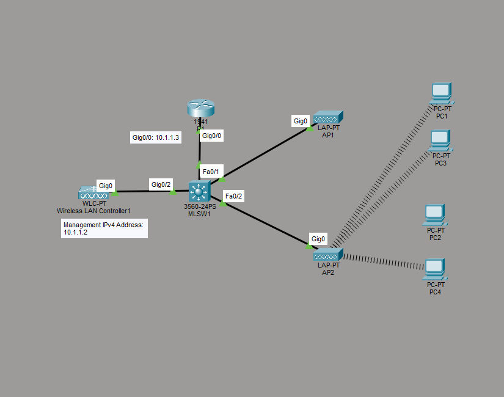

# Setup Wireless LAN Network with Wireless LAN Controller

This is a guide to setup a Wireless LAN Network with a Wireless LAN Controller.



List of Devices:
- PCs:
	- Quantity: 2
	- Model Name: PC-PT
- Switches:
	- Quantity: 2
	- Model Name: 2960
- Routers:
	- Quantity: 3
	- Model Name: 2911

## IP Address Table for the Router
R1:
- Interface: GigabitEthernet0/0
- IPv4 Address: 10.1.1.3
- Subnet Mask: 255.255.255.0

## IP Address Table for the WLC
- Management
	- IPv4 Address: 10.1.1.2
	- Subnet Mask: 255.255.255.0
	- Default Gateway: 10.1.1.1
	- DNS Server: 10.1.1.1

## Configure IP Addresses for the Router

Configure the IP address for the interface of Router0.

Interface GigabitEthernet0/0 for Router0:
```
R1>en
R1#conf t
R1(config)#interface Gig0/0
R1(config-if)#ip add 10.1.1.3 255.255.255.0
```

## Configure DHCP for the Router

Configure DHCP for Router0.

DHCP Configuration for Router0:
```
R1> en
R1# conf t
R1(config)# ip dhcp excluded-address 10.1.1.1 10.1.1.10
R1(config)# ip dhcp pool Pool0DHCP
R1(dhcp-config)# network 10.1.1.0 255.255.255.0
R1(dhcp-config)# default-router 10.1.1.1
R1(dhcp-config)# dns-server 10.1.1.1
R1(dhcp-config)# end
```

## Configure the Wireless LAN Controller

Configure the Wireless LAN Controller1.

Go to the config tab of the WLC. Then go to the Management section. Set the fields for the IP configuration according to the *IP Address Table for the WLC*.

Go to the Wireless LANs section. Set the fields for the Wireless LAN according to the *Wireless LAN of the WLC* down below.

Wireless LAN of the WLC:
- Name: Sunlight
- SSID: Sunlight
- Authentication: WPA2-PSK
- PSK Pass Phrase: key12345

## Enable DHCP for the LAPs

Configure the LAPs to use DHCP to get the IP addresses for the Default Gateway and DNS Server.

## Enable DHCP for the PCs

For each PC, go to the Physical tab of the PC. Power off the PC. Replace the interface with a wireless interface, WMP300N. Power on the PC.

Go to the Config tab then to Wireless0. Set the SSID to Sunlight. Change the authentication to WPA2-PSK. Type key12345 in the **PSK Pass Phrase** field. Set the IP configuration to DHCP. It will be set to Static once its connected to the LAP.

## Save Router Configuration

Go to R1 and save the running configuration to the startup configuration.
```
R1# copy run start
```