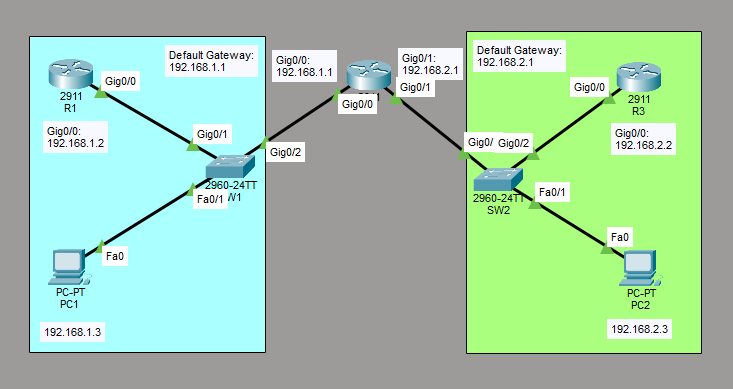
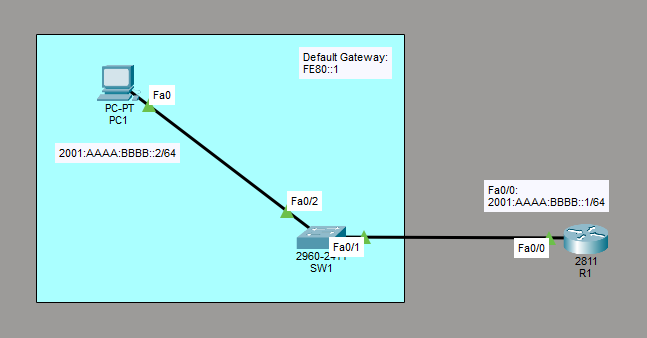

# Verify IP Parameters for Client OS (Windows, macOS, Linux)
This is a guide to verify IP parameters for the client OS. These client operating systems include Windows, MacOS, and Linux.

## Part 1- Verify IPv4 Configuration on the Client OS
You will view and verify the IPv4 configuration on the client OS.



List of Devices:
- PCs:
	- Quantity: 2
	- Model Name: PC-PT
- Switches:
	- Quantity: 2
	- Model Name: 2960
- Routers:
	- Quantity: 3
	- Model Name: 2911

### IPv4 Address Table for the Routers
R1:
- Interface: GigabitEthernet 0/0
	- IPv4 Address: 192.168.1.2
	- Subnet Mask: 255.255.255.0

R2
- Interface: GigabitEthernet 0/0
	- IPv4 Address: 192.168.1.1
	- Subnet Mask: 255.255.255.0
- Interface: GigabitEthernet 0/1
	- IPv4 Address: 192.168.2.1
	- Subnet Mask: 255.255.255.0

R3
- Interface: GigabitEthernet 0/0
	- IPv4 Address: 192.168.2.2
	- Subnet Mask: 255.255.255.0

### IPv4 Address Table for the PCs
PC1:
- IPv4 Address: 192.168.1.3
- Subnet Mask: 255.255.255.0
- Default Gateway: 192.168.1.1

PC2:
- IPv4 Address: 192.168.2.3
- Subnet Mask: 255.255.255.0
- Default Gateway: 192.168.2.1

### Configure IPv4 Address for the Routers
Configure the IPv4 address for the interfaces of the routers.

Interface GigabitEthernet 0/0 on R1:
```
R1> en
R1# conf t
R1(config)# int Gig0/0
R1(config-if)# ip add 192.168.1.2 255.255.255.0
R1(config-if)# no shut
R1(config-if)# end
```

Interface GigabitEthernet 0/0 on R2:
```
R2> en
R2# conf t
R2(config)# int Gig0/0
R2(config-if)# ip add 192.168.1.1 255.255.255.0
R2(config-if)# no shut
R2(config-if)# exit
```

Interface GigabitEthernet 0/1 on R2:
```
R2# conf t
R2(config)# int Gig0/1
R2(config-if)# ip add 192.168.2.1 255.255.255.0
R2(config-if)# no shut
R2(config-if)# end
```

Interface GigabitEthernet 0/0 on R3:
```
R3> en
R3# conf t
R3(config)# int Gig0/0
R3(config-if)# ip add 192.168.2.2 255.255.255.0
R3(config-if)# no shut
R3(config-if)# end
```
### Configure IPv4 Address for the PCs
Configure the IPv4 address for the PCs.

Go to Desktop -> IP Configuration. Set the IPv4 Address, Subnet Mask, and Default Gateway according to the *IPv4 Address Table for the PCs*.

### Verify IP Parameters for the Client OS
Verify the IPv4 configuration on the client OS.

On the PCs, Go to Desktop -> Command Prompt.

Use `ipconfig` on PC1:
```
C:\> ipconfig
```

Use `ipconfig` on PC2:
```
C:\> ipconfig
```

**Note**: The `ipconfig` command is used to check the IPv4 address settings on Windows. The `ifconfig` command is used to check the IPv4 address settings on macOS. The `ip` command is used to check the IPv4 address settings on Linux. 

### Save Router Configurations
For each router, save the running config to the startup config.

Save config for R1:
```
R1# copy run start
```

Save config for R2:
```
R2# copy run start
```

Save config for R3:
```
R3# copy run start
```

## Part 2 - Verify IPv6 Configuration on the Client OS
You will view and verify the IPv6 configuration on the client OS.



List of Devices:
- PCs:
	- Quantity: 1
	- Model Name: PC-PT
- Switches:
	- Quantity: 1
	- Model Name: 2960
- Routers:
	- Quantity: 1
	- Model Name: 2811

### IPv6 Address Table for the Routers
R1:
- Interface: FastEthernet 0/0
	- IPv6 Address: 2001:AAAA:BBBB::1/64
	- Link Local Address: FE80::1

### IPv6 Address Table for the PC
PC1:
- IPv6 Address: 2001:AAAA:BBBB::2/64
- Default Gateway: FE80::1

### Configure IPv6 Address for the Routers
Configure the IPv6 address for the interfaces of the router.

Interface FastEthernet 0/0 on R1:
```
R1> en
R1# conf t
R1(config)# int Fa0/0
R1(config-if)# ipv6 add 2001:aaaa:bbbb::1/64
R1(config-if)# ipv6 add fe80::1 link-local
R1(config-if)# no shut
R1(config-if)# end
```

### Configure IPv6 Address for the PC
Configure the IPv6 address for the PC.

Go to Desktop -> IP Configuration. Set the IPv6 Address and Default Gateway according to the *IPv6 Address Table for the PC*.

### Verify IP Parameters for the Client OS
Verify the IPv6 configuration on the client OS.

On the PCs, Go to Desktop -> Command Prompt.

Use `ipconfig /all` on PC1:
```
C:\> ipconfig /all
```

**Note**: The `ipconfig` command is used to check the IPv6 address settings on Windows. The `ifconfig` command is used to check the IPv6 address settings on macOS. The `ip` command is used to check the IPv6 address settings on Linux.

### Save Router Configuration
Save the running config to the startup config for the router.

Save config for R1:
```
R1# copy run start
```

## Resources
- [Verify IP parameters for Client OS (Windows, Mac OS, Linux) - Learn Tech From Zero](https://learntechfromzero.com/ccna-200-301/windows-mac-os-linux/)
- [ip vs. ifconfig: Which do you use? - Red Hat](https://www.redhat.com/en/blog/ip-vs-ifconfig)
- [12.6.6 Packet Tracer – Configure IPv6 Addressing (Answers)](https://itexamanswers.net/12-6-6-packet-tracer-configure-ipv6-addressing-answers.html)
