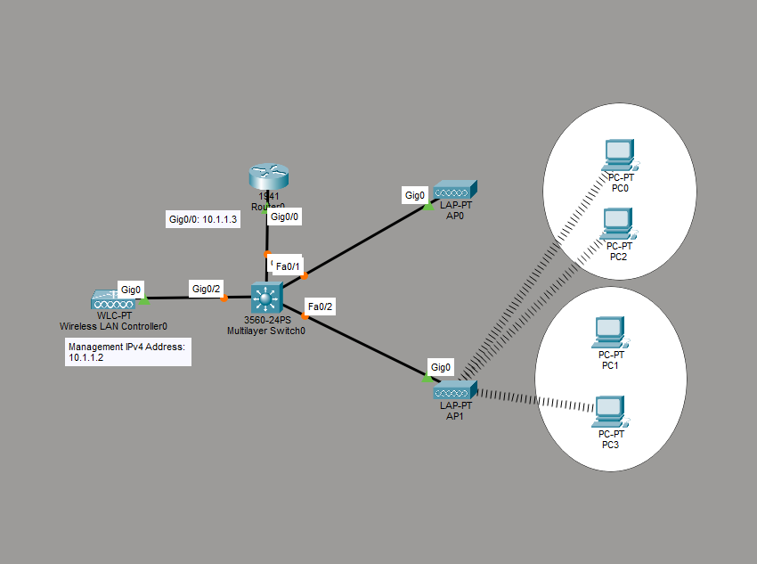

# Wireless LAN Network with Wireless LAN Controller

This is a guide to setup a Wireless LAN Network with a Wireless LAN Controller.



IP Address Table for Router0:
- Interface: GigabitEthernet0/0
- IPv4 Address: 10.1.1.3
- Subnet Mask: 255.255.255.0

Configure the IP address for Router0.

Interface GigabitEthernet0/0 for Router0:
```
Router>en
Router#conf t
Router(config)#interface Gig0/0
Router(config-if)#ip add 10.1.1.3 255.255.255.0
```

Setup DHCP for Router0.

DHCP Configuration for Router0:
```
Router>en
Router#conf t
Router(config)#ip dhcp excluded-address 10.1.1.1 10.1.1.10
Router(config)#ip dhcp pool Pool0DHCP
Router(dhcp-config)#network 10.1.1.0 255.255.255.0
Router(dhcp-config)#default-router 10.1.1.1
Router(dhcp-config)#dns-server 10.1.1.1
Router(dhcp-config)#end
```

Wireless LAN Controller0 Configuration

Go to the config tab of the WLC. Then go to the Management section. Set the fields for the IP configuration according to the *IP Addressing of the WLC* down below.

IP Addressing for the WLC:
- Management
	- IPv4 Address: 10.1.1.2
	- Subnet Mask: 255.255.255.0
	- Default Gateway: 10.1.1.1
	- DNS Server: 10.1.1.1

Go to the Wireless LANs section. Set the fields for the Wireless LAN according to the *Wireless LAN of the WLC* down below.

Wireless LAN of the WLC:
- Name: Sunlight
- SSID: Sunlight
- Authentication: WPA2-PSK
- PSK Pass Phrase: key12345

Configure the LAPs to use DHCP to get the IP addresses for the Default Gateway and DNS Server.

For each PC, go to the Physical tab of the PC. Power off the PC. Replace the interface with a wireless interface, WMP300N. Power on the PC.

Go to the Config tab then to Wireless0. Set the SSID to Sunlight. Change the authentication to WPA2-PSK. Type key12345 in the **PSK Pass Phrase** field. Set the IP configuration to DHCP. It will be set to Static once its connected to the LAP.

Go to Router0 and save the running configuration to the startup configuration.
```
Router#copy running-config startup-config
```